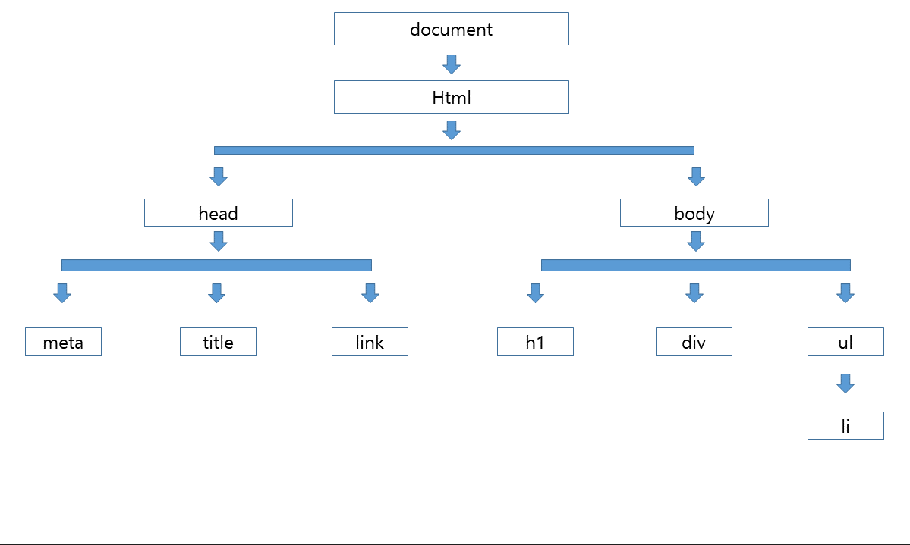

## JS의 탄생 🍰

초창기 웹은 **HTML,CSS만으로 이루어졌고** 앵커태그를 이용해 문서 이동만 가능한 웹 문서였다.    
웹과 이용자가 서로 상호작용하기 위해 HTML 요소를 조작할 수 있는 언어가 필요했다.     
그래서 넷스케이프사에서 개발한 **Netscape Navigator라는(LiveScript언어를 해석 할 수 있는 엔진을 탑재) 브라우저에서 동작할 수 있는**
**LiveScript언어를 개발했고** 이후 당시에 유명한 자바 프로그래밍의 이름을 따서 **JavaScript** 라고 이름을 변경했다. 
또 마이크로소프트에서는 **J스크립트**라는 언어와 우리가 잘 알고 있는 **internet Explorer**라는 브라우저를 출시했다.    
JavaScript와 J스크립트는 엄연히 다른 언어이기 때문에 개발자들은 각각의 브라우저에 맞게 개발을 진행해야하는 귀찮음을 마주했다. 
그래서 넷스케이프사는 웹 페이지에서 동작하는 언어를 표준화하기 위해 자바스크립트 기술 규격을 **Ecma 인터내셔널** 이라는 단체에 제출했고 
표준명세인 **ECMAScript**가 나오게 되었다. 하지만 인터넷 익스플로어의 시장 점유율이 커지면서 인터넷 익스플로어는 웹 표준을 지키지 않았다. 
점점 브라우저의 종류가 많아지고 개발자들의 어려움은 점점 커져갔다. 그래서 개발자들이 일일이 브라우저에 대응하지 않도록 **jQuery**가 나오게 됐다.    
이 jQuery 사용을 하게되면 jQuery 안에서 각 브라우저에 대해 알아서 동작하게 되어 개발 진행이 편리하게 되었다.
그리고 2008년 **강력한 JavaScript 엔진을 가진 Chrome이** 등장하게 되었고 이때부터 모든 브라우저들이 ECMAScript의 표준안에 따라가기 힘쓰게 되었다.  
그렇게 오늘날의 JavaScript는 ECMAScript의 표준안을 따라가면서 발전하고 있다. 

## DOM(Document object Model) 이란??  🙄
웹페이지에서 자바스크립트로 html 요소들을 제어하는데 사용되는 **문서 객체 모델**을 말한다.  

## JavaScript의 html 제어 👨‍🔧

브라우저 안에는 웹 문서를 해석할 수 있는 렌더링 엔진이 있다.
렌더링 엔진은 **HTML, XML과 서식정보인 CSS, XML 등을 읽어들여 사람이 읽을 수 있는 문서로 표시하는, 웹 브라우저의 핵심기능을 담당하는 소프트웨어이다.**
 
브라우저로 html 파일을 열게 되면 렌더링 엔진이 html로 작성된 문서를 한줄 한줄 해석을 한다. 
그리고 해석한 문서를 객체화해서 js로 접근하게 한다. 

그래서 문서 객체 모델이라 한다.

## DOM Tree 🌳



<br/>

`html` 안에는 `head`, `body`가 있다. head 안에는 `meta`,`title` 태그가 
`body` 안에는 `h1`,`p`,`div` 태그가 올 수 있듯이 위 그림을 그려보면 tree 구조가 나타는걸 볼 수 있다. 
각각의 요소를 `node`라고 한다. 그래서 DOM Tree는 node의 집합이라 말할 수 있다.

그래서 웹 문서 영역을 제어할 수 있는 객체 = document 객체 (DOM tree 최상위 노드)   
document 객체는 html 요소에 접근하기 위한 진입점이다. 

```toc

```