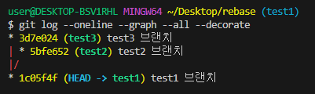
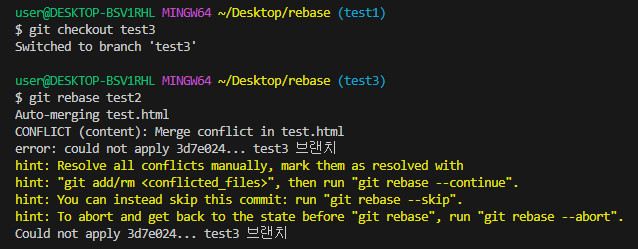
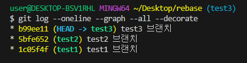

# Git Rebase란? 
Git Rebase 란 말 그대로 base를 재설정한다는 의미로,   
하나의 브랜치가 다른 브랜치에서 파생되서 나온 경우,    
다른 브랜치에서 진행된 커밋을 다시 가져와서 base를 재설정하는 것입니다.

## Rebase 진행 과정 

위 예제는 아래와 같은 명령으로 Rebase 한다. 
```
$ git checkout experiment
$ git rebase master
``` 
 
+ experiment 브랜치로 이동해 master를 base삼아 Rebase 하겠다는 의미입니다. 
+ 그러면 내부에서는 master가 base가 되고, C3과 C4의 차이를 임시 저장하는 공간에 저장합니다.       
   이 임시저장 공간을 `Patch`라고 합니다.
+ 그리고 base가 되는 master에 Patch들이 적용됩니다

위 내용을 정리해보면 
1. 공통 커밋(C2)에서 시작해서 현재 체크아웃한 experiment 브랜치가 가리키는 커밋까지    
   diff를 차례대로 만들어 Patch에 저장
2. experiment브랜치가 master브랜치를 가리키게 함
3. C3에 Patch를 순서대로 적용 


마지막으로 아래 명령어로 master 브랜치를 [Fast-foward](https://velog.io/@devp1023/GIT-%EB%B3%91%ED%95%A9-%EC%B6%A9%EB%8F%8C-%ED%95%B4%EA%B2%B0-3-way-merge-fast-forward#span-stylecolorcornflowerblue-fast-forwardspan) 시켜야 합니다. 

``` 
$ git checkout master
$ git merge experiment
```


## 실제 적용해보기 
   

+ 위 이미지와 같이 test1 브랜치는 base이고 test2와 test3 branch가 파생된 것을 알 수 있다. 


+ test3 branch를 test2 branch로 Rebase 시키기 위해 test3 브랜치로 와서   
`git rebase test2` 명령어를 통해 test3의 베이스를 test2로 재설정한다  

+ rebase를 할때 conflict(충돌)가 발생하게 되면 해소해 주어 병합하면 된다. 
+ 위 사진에서도 conflict(충돌)가 일어난걸 볼 수 있어서 conflict 해결 후 merge해 주었다.   

   
이제 다시 커밋 이력을 보게 되면 한줄로 되어 있는걸 확인할 수가 있다!! 

## Git Rebase의 장점 
1. Git Rebase를 하면 파생된 브랜치의 커밋이력이 기준 브랜치와 같아지므로 작업순서대로 커밋 이력이 남게 됩니다.    
   그러므로 커밋 히스토리가 시간순서대로 반영되어 이력관리가 용이해집니다.

2. merge를 통해 발생하는 불필요한 병합 커밋을 제거할 수 있습니다.   
+ 병합시에는 병합 커밋 이력이 남기 때문에 히스토리에 불필요한 커밋이 늘어나게 됩니다.    
  하지만 rebase는 마치 하나의 브랜치에서 작업된 것처럼 병합이 아닌 선형의 커밋 히스토리가 남기 때문에    
  작업이력을 확인하기 편합니다. 


```toc
``` 