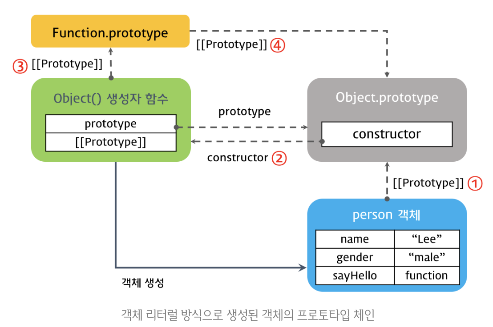

# 프로토타입 객체

자바스크립트의 모든 객체는 자신의 부모 역할을 담당하는 객체와 연결되어 있습니다. 그리고 이것은 마치 객체 지향의 상속 개념과 같이 부모 객체의 프로퍼티 또는 메소드를 상속받아 사용할 수 있게 합니다. 이러한 부모 객체를 **Prototype(프로토타입) 객체 또는 줄여서 Prototype(프로토타입)이라 합니다.**

Prototype 객체는 생성자 함수에 의해 생성된 각각의 객체에 공유 프로퍼티를 제공하기 위해 사용한다.

## \_\_proto\_\_ vs prototype 프로퍼티

```js
function Person(name) {
  this.name = name;
}

var foo = new Person('Lee');

console.dir(Person); // prototype 프로퍼티가 있다.
console.dir(foo); // prototype 프로퍼티가 없다.
```

- prototype

  1. 함수 객체만 가지고 있는 프로퍼티이다

  2. 생성된 객체가 부모를 가르킵니다. 즉, 생성자 함수(또는 클래스)가 제공하는 공통 정보를 담 제공하는 객체라고 생각하시면 됩니다.

  ```js
  console.log(Person.prototype === foo.__proto__);
  ```

  => foo라는 인스턴스는 부모인 Person 객체(정보를 제공하는 객체) 가르킵니다.

- \_\_proto\_\_ === [[Prototype]]입니다.

  1. 함수를 포함한 모든 객체가 가지고 있습니다.

  2. 자신의 부모 역할을 하는 프로토타입 객체를 가르킵니다.

  ```js
  console.log(Person.__proto__ === Function.prototype);
  ```

  => Function.prototype은 Person 생성자 함수에게 정보를 제공하는 객체로서 부모 역할을 하기 때문에 위와 같은 결과가 나옵니다.

## constructor

constructor: prototype(공유 정보 제공 객체)을 생성한 객체를 가르킵니다.

```js
function Person(name) {
  this.name = name;
}

var foo = new Person('Lee');

// Person.prototype 객체를 생성한 객체는 Person() 생성자 함수입니다.
console.log(Person.prototype.constructor === Person);

// foo 객체를 생성한 객체는 Person() 생성자 함수입니다.
console.log(foo.constructor === Person);

// Person() 생성자 함수를 생성한 객체는 Function() 생성자 함수이다.
console.log(Person.constructor === Function);
```

## 프로토타입 체인

자바스크립트는 특정 객체의 프로퍼티나 메소드에 접근하려고 할 때 해당 객체에 접근하려는 프로퍼티 또는 메소드가 없다면 \_\_proto\_\_ 가리키는 링크를 따라 자신의 부모 역할을 하는 프로토타입 객체의 프로퍼티나 메소드를 차례대로 검색한다. 이것을 **프로토타입 체인**이라 한다.

### 생성자 함수로 생성된 객체의 프로토타입 체인

```js
var person = {
  name: 'Lee',
  gender: 'male',
  sayHello: function () {
    console.log('Hi! my name is ' + this.name);
  },
};

console.log(person.__proto__ === Object.prototype); // ① true
console.log(Object.prototype.constructor === Object); // ② true
console.log(Object.__proto__ === Function.prototype); // ③ true
console.log(Function.prototype.__proto__ === Object.prototype); // ④ true
```



1. Person 객체와 Object.prototype의 관계

- person 인스턴스는 객체리터럴로 생성이 되었고 공유 정보를 제공하는 객체는 Object.prototype 객체입니다.

2. Object.prototype의 Object 관계

- Object 생성자 함수에 의해 Object.prototype(공유 정보 객체)을 생성했습니다.

3. Object와 Function.prototype의 관계

- Object는 자바스크립트에서 모든 객체를 생성할 수 있는 생성자 함수입니다.
  Object 자체도 함수이기 때문에, Function.prototype을 상속받습니다.
  즉, Object.\_\_proto\_\_ === Function.prototype이 성립합니다

4. Function.prototype과 Object.prototype의 관계

- Function.prototype은 일반 객체입니다. 그래서 Object.prototype에서 상속받습니다.

  출처, 참고: https://poiemaweb.com/js-prototype#42-%EC%83%9D%EC%84%B1%EC%9E%90-%ED%95%A8%EC%88%98%EB%A1%9C-%EC%83%9D%EC%84%B1%EB%90%9C-%EA%B0%9D%EC%B2%B4%EC%9D%98-%ED%94%84%EB%A1%9C%ED%86%A0%ED%83%80%EC%9E%85-%EC%B2%B4%EC%9D%B8

```toc

```
