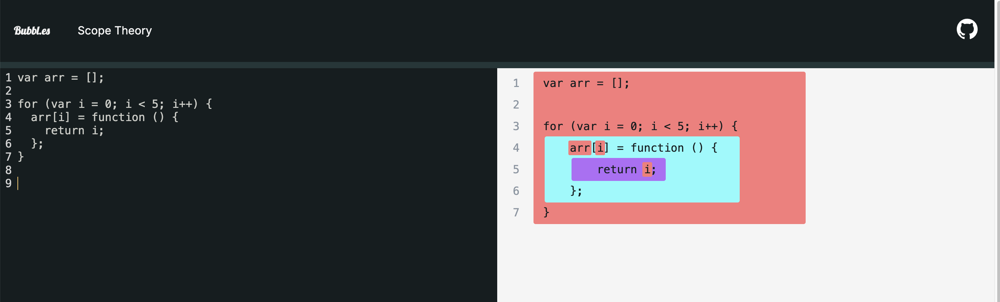
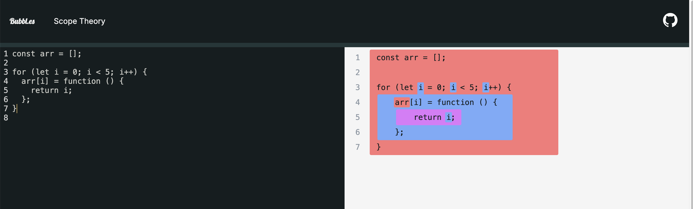

# 스코프

스코프(scope)는 변수에 접근할 수 있는 범위를 말한다. 스코의 종류는 2가지가 있다.

## 스코프와 변수의 관계

- 전역 스코프 : 코드 어디에서든지 접근이 가능하다.
- 지역 스코프 : 함수 코드 블록이 만든 스코프로 함수 자신과 하위 함수에서만 접근 할 수 있다.

=> 전역에서 선언된 변수는 전역 스코프를 갖게 되고 지역에서 선언된 변수는 지역 스코프를 갖게 된다.

## 블록 레벨 스코프

- `let`이나 `const` 키워드로 선언된 변수가 블록 내에서만 유효하도록 하는 스코프이다.
- 블록은 주로 `if`문, `for`문, `while`문 등에서 중괄호 `{ }`로 감싸진 코드 영역을 의미한다.

```js
if (true) {
  let blockScopedVariable = '블록 스코프 변수입니다.'; // 블록 스코프에서 변수 선언
  console.log(blockScopedVariable); // 접근 가능
}

console.log(blockScopedVariable); // 전역 스코프이므로 접근 불가능!
// ReferenceError: blockScopedVariable is not defined
```

## 함수 레벨 스코프

- 함수 내부에서 선언된 변수는 해당 함수 안에서만 접근 가능하고, 함수 외부에서는 접근할 수 없다

```js
function sayHello() {
  var localVariable = '함수 스코프 변수입니다.'; // 함수 스코프에서 변수 선언
  console.log(localVariable); // 접근 가능
}

sayHello(); // '함수스코프입니다' 출력!
console.log(localVariable); // 전역 스코프이므로 접근 불가능!
// ReferenceError: localVariable is not defined
```

# 클로저

## 렉시컬 스코핑

- 함수의 선언 위치에 따라 스코프가 결정된다

```js
function outerFunc() {
  var x = 10;
  var innerFunc = function () {
    console.log(x);
  };
  innerFunc();
}

outerFunc(); // 10
```

innerFunc는 함수 outerFunc의 내부에서 선언되었기 때문에 함수 innerFunc의 상위 스코프는 함수 outerFunc이다. 함수 innerFunc가 전역에 선언되었다면 함수 innerFunc의 상위 스코프는 전역 스코프가 된다.

## 스코프 체인

스코프 체인은 변수를 참조할 때 스코프의 계층 구조를 따라 올라가며 찾는 메커니즘이다.

```js
function outerFunc() {
  var x = 10;
  var innerFunc = function () {
    console.log(x);
  };
  innerFunc();
}

outerFunc(); // 10
```

innerFunc 함수 내에서는 console.log(x) 를 출력해야 하지만 innerFunc 함수 내에서는 x 라는 변수가 선언되어 있지 않다.
그래서 x의 값을 할당해주기 위해 상위 스코프인 outerFunc 함수 내에서 x를 찾아 값을 참조한다.
만약에 outerFunc 내에서도 x를 찾지 못한다면 outerFunc의 상위 스코프에서 값을 찾을 것이다.

## 클로저 함수

- 자신을 포함하고 있는 외부함수보다 내부함수가 더 오래 유지되는 경우, 외부 함수 밖에서 내부함수가 호출되더라도 외부함수의 지역 변수에 접근할 수 있는데 이러한 함수를 클로저(Closure)라고 부른다.
- 렉시컬 스코프 : 자신이 선언될 때의 환경
- 환경 레코드(Environment Record): 함수 내부에서 선언된 변수와 해당 값을 저장하는 객체

```js
function outerFunc() {
  var x = 10;
  var innerFunc = function () {
    console.log(x);
  };
  return innerFunc;
}

var inner = outerFunc();
inner(); // 10
```

1. 함수 outerFunc는 내부함수 innerFunc를 변수 inner에 반환하고 생을 마감했다.
2. inner에 반환된 함수는 소멸된 outerFunc에 접근조차 할 수 없다.
3. 하지만 반환된 innerFunc는 렉시컬 환경을 기억하고 있어서 x에 접근할 수 있다
   - innerFunc의 렉시컬 환경 - 환경 레코드: 없음 , 외부 참조 : outerFunc의 렉시컬 환경
   - innerFunc의 렉시컬 환경 - 환경 레코드: var x = 10; , 외부 참조 : 글로벌 환경 (= 전역 환경)

## 클로저의 활용

### 상태 유지, 정보 은닉, 전역 변수 사용 억제

```js
function createCounter() {
  let count = 0; // 상태를 저장하는 변수

  return {
    increment: function () {
      count++;
      return count;
    },
    decrement: function () {
      count--;
      return count;
    },
    getCount: function () {
      return count;
    },
  };
}

const counter = createCounter();
console.log(counter.increment()); // 1
console.log(counter.increment()); // 2
console.log(counter.decrement()); // 1
console.log(counter.getCount()); // 1
```

- count는 외부에서 직접 접근할 수 없습니다 (정보 은닉)
- increment, decrement, getCount 메서드를 통해서만 count를 조작할 수 있습니다 (상태 유지)
- 만약에 count 변수가 전역 변수이면 다른 곳에서 조작이 가능해 동작은 하나 값에 오류가 발생 할 수 있음 (전역 변수 사용 억제)

### 자주 발생하는 실수

```js
var arr = [];

for (var i = 0; i < 5; i++) {
  arr[i] = function () {
    return i;
  };
}

for (var j = 0; j < arr.length; j++) {
  console.log(arr[j]());
}
```



우리가 생각하는 기대값은 0부터 4의 값이 출력되는걸 생각했겠지만 위 코드는 4가 5번 출력하게 된다. 왜냐하면 var는 전역 변수로 취급되기 때문에 i의 값이 바뀔때마다 지역이 아닌 전역에서 바뀌기 때문에 값이 계속 업데이트가 된다. 그래서 결국 arr의 모든 인덱스에 4의 값이 저장된다.

### let 사용을 통한 실수 해결

```js
const arr = [];

for (let i = 0; i < 5; i++) {
  arr[i] = function () {
    return i;
  };
}

for (let i = 0; i < arr.length; i++) {
  console.log(arr[i]());
}
```



let을 사용하게 되면 블록스코프가 for문에 있는 함수의 상위스코프가 전역이 아닌 for의 초기 선언문이 된다.
그래서 각 순회때 렉시컬 환경에서의 i 값을 기억해 0 부터 4까지의 출력값이 나온다.

스코프 참고 링크 : https://poiemaweb.com/js-scope  
클로저 참고 링크 : https://poiemaweb.com/js-closure  
스코프 시각화 사이트 : https://jsbubbl.es/bubbles#Y29uc3QgYXJyID0gW107Cgpmb3IgKGxldCBpID0gMDsgaSA8IDU7IGkrKykgewogIGFycltpXSA9IGZ1bmN0aW9uICgpIHsKICAgIHJldHVybiBpOwogIH07Cn0K

```toc

```
