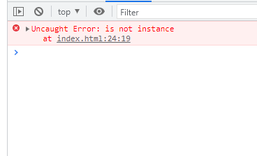

# 필수 구현 사항 
+ null 혹은 undefined의 데이터가 넘어올때의 데이터 체크    

+ 인스턴스 확인하기   

+ 배열 확인하기 


## 소스코드 

### html 
```html 
<div id="todo-list"></div> 
``` 

### js
```js 
     /* 인스턴스 확인 */
            if (!new.target) {
                throw new Error("is not instance");
            }

            /* 
            JS에서 false로 간주되는것들: undfiend, null, 0(숫자리터럴), -0, ""(빈문자열), false 이다 
            주의해야할 사항은 빈 문자열은 false 이지만 빈배열, 빈객체는 true라는 점이다. 
            */
            if (!data) {
                throw new Error("check Null or Undefined");
            }

            /* 데이터 타입 확인*/
            if (!Array.isArray(data)) {
                throw new Error("todoList is not Array");
            }

            this.render = function () {
                data.forEach((item) => {
                    document.querySelector(`#todo-list`).innerHTML += `<div>오늘의 할 일은 ${item.text} 입니다!!</div>`;
                }
                )
            }
``` 

## 인스턴스 확인  
+ new.target은 new 연산자를 사용했는지 여부를 감지하는 것이다. 
+ new 연산자와 함께 생성자 함수로서 호출되면 함수 내부의 new.target은 함수 자신을 가리킨다. 
+ new 연산자 없이 일반 함수로서 호출된 함수 내부의 new.target은 undefined다.

<br>

## null or undefined 확인  
+ data가 null or undefined가 넘어오게 되면 false로 취급하기 때문에 Not 연산자와 만나 true가 되어 if문을 실행한다.      

## 배열 확인
+ 파라미터로 입력받은 data가 배열인지의 여부를 boolean 값으로 리턴한다. 
+ typeof를 사용해 배열을 검사하면, typeof는 'object'를 리턴한다. 왜냐하면 배열은 object의 특수한 한 형태이기 때문이다. 
+ 배열이 아닐경우에 false를 리턴하고 Not 연산자와 만나 true가 되어 if문을 실행한다.  

## throw new Error 
+ throw 문은 사용자가 정의한 예외를 발생시킬 수 있다. 즉, 자바스크립스에서 에러라고 인식하지 않아도 내가 생성한 함수의 규칙에 
  어긋나서 에러 처리를 하고 싶은 경우를 말한다. 
+ 위 세가지 if문을 봤을때 해당 조건문이 참일 경우에 throw new Error가 발생하고 함수를 중지시킨다. 
+ throw 혼자가 아니라 Error 객체를 같이 사용함으로써 해당 콜 스택 정보가 같이 출력되기 때문에    
  어디에서 에러가 발생했는지에 대한 정보를 얻을 수 있다. 

## 결과 
   
   


```toc
``` 