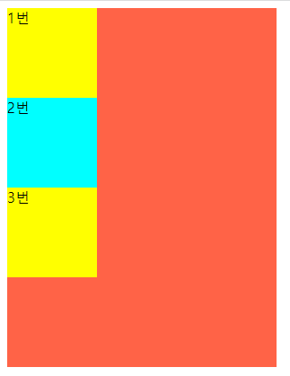
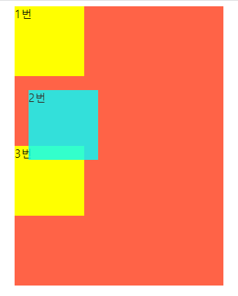
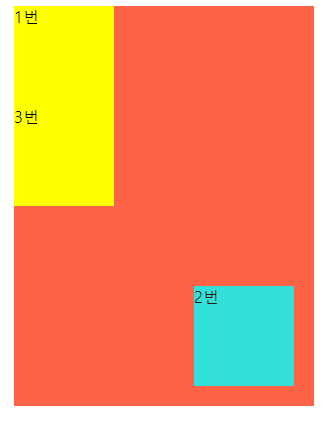

# position 속성  

1. CSS에서 **`position`** 속성은 HTML 문서 상에서 요소가 배치되는 방식을 결정한다. 
2. **`position`** 속성은 요소의 정확한 위치 지정을 위해서 **`top`**, **`left`**, **`bottom`**, **`right`** 속성과 함께 사용된다

# position: static 

1. position 속성을 별도로 지정해주지 않으면 기본값인 static이 적용된다 

2. 요소들이 HTML에 작성된 순서대로 브라우저 화면에 표시가 된다.    
   따라서 **`top`**, **`left`**, **`bottom`**, **`right`** 속성값은 **`position`** 속성이 **`static`**일 때는 무시된다.


```css
<style>

    body{
        display: flex;
        justify-content: center;
        align-items: center;
    }

    main {
        width: 300px;
        height: 400px;
        background: tomato;
    }

    div:nth-child(1) {
        width: 100px;
        height: 100px;
        background-color:yellow;
    }

    div:nth-child(2) {
        width: 100px;
        height: 100px;
        background-color:aqua;
    }

    div:nth-child(3) {
        width: 100px;
        height: 100px;
        background-color:yellow
    }

</style>
```
```html
<body>
    <main>
        <div>1번</div>
        <div>2번</div>
        <div>3번</div>
    </main>
</body>
```



**위 결과를 보면 작성된 순서대로 배치 되는걸 볼 수 있다.** 

# position: relative 

1. position 속성을 relative로 설정하게 되면, 요소를 원래 위치에서 벗어나게 배치할 수 있게 된다. 

2. 요소의 위치 지정은 **`top`**, **`bottom`**, **`left`**, **`right`** 속성을 이용해서    
   요소가 원래 위치에 있을 때의 상하좌우로 부터 얼마나 떨어지게 할지를 지정할 수 있다.


```css
<style>

    body{
        display: flex;
        justify-content: center;
        align-items: center;
    }

    main {
        width: 300px;
        height: 400px;
        background: tomato;
    }

    div:nth-child(1) {
        width: 100px;
        height: 100px;
        background-color:yellow;
    }

    div:nth-child(2) {
        width: 100px;
        height: 100px;
        background-color:aqua;
        opacity: 0.8;
        position: relative;
        top: 20px;
        left: 20px;
    }

    div:nth-child(3) {
        width: 100px;
        height: 100px;
        background-color:yellow
    }

    </style>
```
```html
<body>

    <main>
        <div>1번</div>
        <div>2번</div>
        <div>3번</div>
    </main>
    
</body>
```



# position: absolute 

1. **`position`** 속성이 **`absolute`** 일 때 해당 요소는 배치 기준을 자신이 아닌 상위 요소에서 찾는다.

2. 부모 요소(가장 가까운 상위 요소)를 기준으로 **`top`**, **`left`**, **`bottom`**, **`right`** 속성을 적용해야 힌다. 

3. 기준은 **`position`** 이 **`relative`** 또는 **`fixed`** 또는 **`absolute`** 인 부모가 된다.
   보통 부모요소에 **`position:relative`** 를 부여한다.


```css
<style>

    body{
        display: flex;
        justify-content: center;
        align-items: center;
    }

    main {
        position: relative;
        width: 300px;
        height: 400px;
        background: tomato;
    }

    div:nth-child(1) {
        width: 100px;
        height: 100px;
        background-color:yellow;
    }

    div:nth-child(2) {
        width: 100px;
        height: 100px;
        background-color:aqua;
        opacity: 0.8;
        position: absolute;
        bottom: 20px;
        right: 20px;
    }

    div:nth-child(3) {
        width: 100px;
        height: 100px;
        background-color:yellow
    }

    </style>
```
```html
<body>
    <main>
        <div>1번</div>
        <div>2번</div>
        <div>3번</div>
    </main>
</body>  
```



1. 위 결과를 보면 `div`의 부모는 `main`이기 때문에 main 영역 안에서 독립적으로 작용하는걸 볼 수 있다

2. 위 코드에서 main에 `relative` 를 적용하지 않는다면 아마 웹 브라우저 우측 하단에 2번재 div가 출력되는걸 볼 수 있을것이다 

# position:fixed 

1. `fixed`는 요소를 고정하는데 사용된다.** 

2. `fixed` 의 배치 기준은 자신이나 부모 요소가 아닌 브라우저 전체화면이다. 

3. 웹사이트를 보면 카테고리를 포함한 상단이 스크롤을 내려도 고정되어있는 것을 볼 수 있다. 


```css
<style>

    main {
        position: relative;
        width: 300px;
        height: 400px;
        background: tomato;
        margin: auto;
    }

    div:nth-child(1) {
        width: 100px;
        height: 100px;
        background-color:yellow;
    }

    div:nth-child(2) {
        width: 100px;
        height: 100px;
        background-color:aqua;
        opacity: 0.8;
        position: fixed;
        bottom: 20px;
        right: 20px;
    }

    div:nth-child(3) {
        width: 100px;
        height: 100px;
        background-color:yellow
    }

    </style>
```
```html
<body>
    <main>
        <div>1번</div>
        <div>2번</div>
        <div>3번</div>
    </main>
</body>
```


**위 결과를 보면 2번째 div가 독립적으로 작용되어 main이 기준이 아닌   브라우저 전체화면이 기준이기 때문에 우측 하단에 고정되어 있는걸 볼 수 있다.** 

# position: sticky 

1. `sitcky` 속성은 필수적으로 `top`, `bottom`, `left`, `right`중에 
      하나를 필수적으로 설정해야한다.**

2. `sitcky`로 설정된 영역은 설정된 위치(예 top: 0px)에 도달하기 전까지는    
   `static`속성처럼 행동하다가 설정된 위치에 다다르면 **`fixed`** 속성처럼 행동하는 속성이다.

3. 아래의 `overflow` 속성들 중 하나를 필수로 적용해야한다. 
    
    + `overflow: hidden` 
    
    + `overflow: scroll` 
    
    + `overflow: auto` 

sticky에 대해서 추가 사항은 아래글은 참고하면 좋을거 같습니다!

[position:sticky 알아보기](https://www.daleseo.com/css-position-sticky-header/)