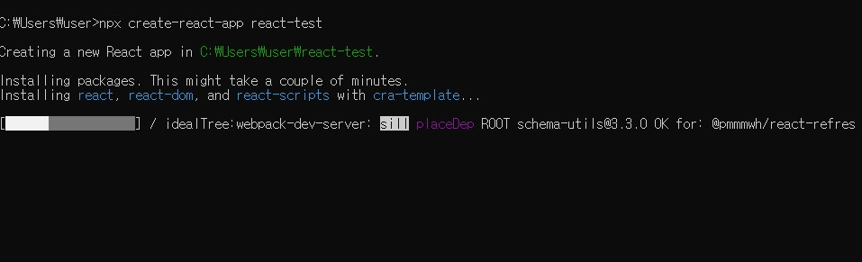

# Create React App

Create React App은 단일 페이지의 React 앱을 만들 위한 방법입니다.

## 프로젝트 생성을 위한 조건

프로젝트를 생성하기 위해서는 Node.js가 설치되어 있어야 한다.  
버전은 각 os에 맞는 recommand 버전을 다운 받으면 된다.

터미널을 열고 아래와 같이 명령어를 입력해 설치된 Node.js의 버전을 확인한다.

```
node -v
```

## 프로젝트 생성 과정

1. 터미널을 열고 아래 명령어를 입력 하면 react-test라는 폴더가 생성된다.

```
npx create-react-app react-test
```



2. 아래 명령어를 입력해 vscode에서 폴더 열기

```
code react-test
```

3. vscode에서 터미널을 열어 아래 명령어를 입력하면 localhost 3000; 이라는  
   내 컴퓨터의 포트 번호 3000번 서버에서 리액트 앱이 실행된다.

```
npm start
```

## 프로젝트 진행

프로젝트를 진행하기 전에 src폴더에는 App.js와 index.js를 제외한 나머지 파일들을 삭제하고 시작한다.

## App.js

```js
import { useEffect, useState } from 'react';
import styles from './Button.module.css';

function App() {
  const [counter, setValue] = useState(0);
  const [keyword, setKeyword] = useState('');
  const onChange = (event) => {
    setKeyword(event.target.value);
  };
  const onCLick = () => {
    setValue((prev) => prev + 1);
  };
  useEffect(() => {
    console.log('call me once');
  }, []); // 빈 배열일때는 한번만 동작한다.
  useEffect(() => {
    console.log('search for', keyword);
  }, [keyword]); // 배열 안에 있는 state 값이 변화할 때만 동작한다.
  useEffect(() => {
    console.log('change', counter);
  }, [counter]);
  useEffect(() => {
    console.log(`change ${keyword} & ${counter}`);
  }, [keyword, counter]); // 둘 중 한개의 값만 변화하더라도 동작한다.

  return (
    <div>
      <input value={keyword} onChange={onChange} placeholder="Search" />
      {/* <h1>{counter}</h1> */}
      <button className={styles.btn} onClick={onCLick}>
        click
      </button>
      {/* <Button text={"Continue"} /> */}
    </div>
  );
}
```

### useEffect

useEffect 함수는 리액트 컴포넌트 렌더링 될때마다 특정 작업을 실행할 수 있도록
하는 Hook이다.

1. { }에는 동작하고자 하는 코드를 작성하면 된다.
2. [ ]에는 검사하고자 하는 특정값 or 빈 배열

#### case 1 : 빈배열

```
useEffect(() => { console.log("call me once"); }, [])
```

처음 렌더링 될 때만 동작한다.
<br>

#### case 2 : 배열 안에 state 값이 1개만 있을 경우

```
useEffect(() => { console.log('change', counter); }, [counter]);
```

state 값이 (counter의 값) 변화할 때만 동작한다.
<br>

#### case 3 : 배열 안에 state 값이 2개 있을 경우

    ```
    useEffect(() => { console.log('change', counter); }, [keyword,counter])
    ```
    둘 중 한개의 state 값만 변화하더라도 동작한다.

### className

```js
<button className={styles.btn} onClick={onCLick}>
  click
</button>
```

1. create-react-app은 무작위 랜덤 클래스를 생성한다.
2. CSS 클래스 이름이 다른 관계 없는 곳에서 사용한 CSS클래스 이름과 중복되는 일이 없게 하기 위함이다.
3. className을 설정할때는 styles.btn와 같이 import로 불러온 styles 객체 안에 값을 참조해야한다.

## index.js

```js
import React from 'react';
import ReactDOM from 'react-dom/client';
import App from './App';

const root = ReactDOM.createRoot(document.getElementById('root'));
root.render(<App />);
```

## Button.module.css

src 폴더에 Button.module.css 파일을 만든다.

```css
.btn {
  background-color: tomato;
  color: white;
}
```

```toc

```
