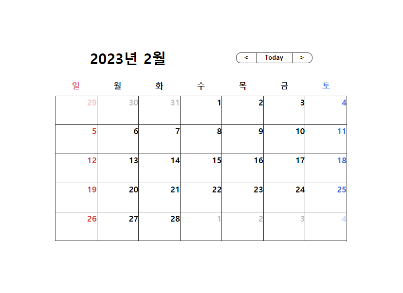
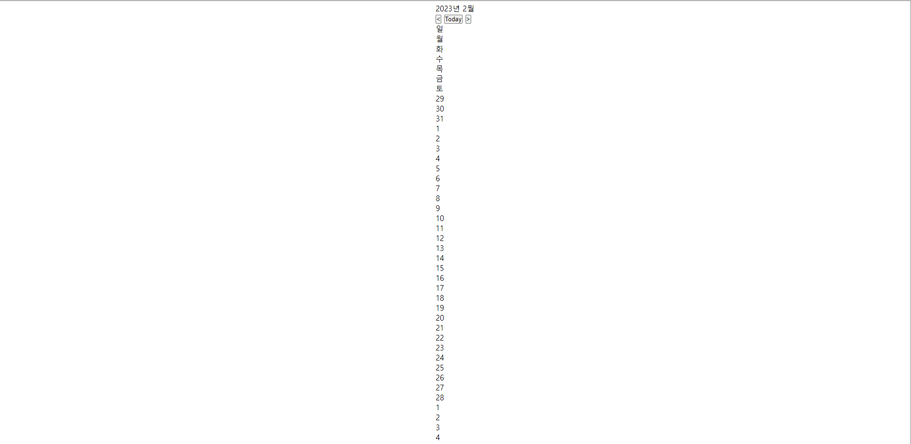

# Calendar 기능 구현(1)



위 사진은 바로 우리가 만들 달력의 결과물입니다.    
위와 같은 달력을 만들기 위해서 처음부터 천천히 진행해 봅시다!!!   

<br>

## 소스 코드

```js

// 날짜 가져오기 

let dt = new Date();
function renderCalendar() {
  const view_year = dt.getFullYear();
  const view_month = dt.getMonth();
  document.querySelector(".year-month").textContent = `${view_year}년 ${view_month + 1}월`

  const preLast = new Date(view_year, view_month, 0) // 이전달 마지막 날짜 
  const thisLast = new Date(view_year, view_month + 1, 0) // 이번달 마지막 날짜 

  const preDate = preLast.getDate();
  //  현지 시간 기준 일을 반영 (1~31)
  const preDay = preLast.getDay();
  /*  
      현지 시간 기준 요일 반영(0~6)
      일요일: 0, 월요일: 1, 화요일: 2 
  */

  const tdDate = thisLast.getDate(); // 이번달 마지막 날짜의 요일 값
  const tdDay = thisLast.getDay(); // 이번달 마지막 날짜의 인덱스 값

  const preDates = [];
  const thisDates = [...Array(tdDate + 1).keys()].slice(1);
  const nextDates = [];
  /*
  1. Array(n)으로 배열을 만들면 길이가 n인 배열이 생성됩니다. (이때 모든 요소들은 undefined)
  2. 그런데 모든 요소들이 empty 값이기 때문에 keys() 메서드를 활용하면 0부터 n - 1까지의 Array Iterator가 생성
  3. 전개 구문을 통해서 이 Array Iterator를 배열로 만들어 내면 0부터 n-1까지의 배열을 얻어낼 수 있음.
  4. 그래서 이번 달 마지막 날짜 + 1을 n에 전달
  5. 제일 앞에 있는 0을 없애기 위해서 slice 메서드를 활용
  */

  if (preDay !== 6) {
    for (let i = 0; i < preDay + 1; i++) {
      preDates.unshift(preDate - i);
    }
  }
  /* 지난달 마지막 요일이 토요일인 경우(index값이 6) 출력할 필요가 없음 
  반복문 - 0(index값 0 =일요일) 시작으로 해서 마지막 요일(preDay)까지 반복 
  배열안에 마지막날을 시작으로 1씩 감소한 값을 배열 앞에 채워 넣었습니다
  */

  for (let i = 1; i < 7 - tdDay; i++) {
    nextDates.push(i);
  }
  const dates = preDates.concat(thisDates, nextDates); // 배열을 합침 
  const firstDateIndex = dates.indexOf(1);
  const lastDateIndex = dates.lastIndexOf(tdDate);
  /*
  indexOf 함수는, 문자열(string)에서 특정 문자열(searchvalue)을 찾고, 
  검색된 문자열이 '첫번째'로 나타나는 위치 index를 리턴합니다.
  */
  dates.forEach((date, i) => {
    const condition = i >= firstDateIndex && i < lastDateIndex + 1
      ? 'this'
      : 'other';

    dates[i] = `<div class="date"><span class="${condition}">${date}</span></div>`;
  })
  //dates.forEach((배열값,인덱스값))

  document.querySelector('.dates').innerHTML = dates.join('');
}
const goPre = document.querySelector(".go-pre");
const goNext = document.querySelector(".go-next");
const goTd = document.querySelector(".go-today")
function preMonth() {
  dt.setMonth(dt.getMonth() - 1)
  renderCalendar();
}

function nextMonth() {
  dt.setMonth(dt.getMonth() + 1)
  renderCalendar();
}

// element.setMonth(element.getMonth())는 12월이 넘어갈때 자동으로 연도가 바뀜  

function todaybtn(){
  dt = new Date();
  renderCalendar();
}

renderCalendar()
goPre.addEventListener("click", preMonth);
goNext.addEventListener("click", nextMonth);
goTd.addEventListener("click", todaybtn);
```
<br>
<br>

# renderCalendar 함수 


```js
function renderCalendar() {
  const view_year = dt.getFullYear();
  const view_month = dt.getMonth();
  document.querySelector(".year-month").textContent = `${view_year}년 ${view_month + 1}월`

  const preLast = new Date(view_year, view_month, 0) // 이전달 마지막 날짜 
  const thisLast = new Date(view_year, view_month + 1, 0) // 이번달 마지막 날짜 

  const preDate = preLast.getDate();
  //  현지 시간 기준 일을 반영 (1~31)
  const preDay = preLast.getDay();
  /*  
      현지 시간 기준 요일 반영(0~6)
      일요일: 0, 월요일: 1, 화요일: 2 
  */

  const tdDate = thisLast.getDate(); // 이번달 마지막 날짜의 요일 값
  const tdDay = thisLast.getDay(); // 이번달 마지막 날짜의 인덱스 값

  const preDates = [];
  const thisDates = [...Array(tdDate + 1).keys()].slice(1);
  const nextDates = [];

  if (preDay !== 6) {
    for (let i = 0; i < preDay + 1; i++) {
      preDates.unshift(preDate - i);
    }
  }

  for (let i = 1; i < 7 - tdDay; i++) {
    nextDates.push(i);
  }
  const dates = preDates.concat(thisDates, nextDates); // 배열을 합침 
  const firstDateIndex = dates.indexOf(1);
  const lastDateIndex = dates.lastIndexOf(tdDate);
    
  dates.forEach((date, i) => {
    const condition = i >= firstDateIndex && i < lastDateIndex + 1
      ? 'this'
      : 'other';

    dates[i] = `<div class="date"><span class="${condition}">${date}</span></div>`;
  })
  //dates.forEach((배열값,인덱스값))

  document.querySelector('.dates').innerHTML = dates.join('');
}
```
<br>
<br>

## 날짜 구하기 

1. `const view_year = dt.getFullYear()`

    + 연도를 가져오는 변수 설정 


2. `const view_month = dt.getMonth()`

    + 월을 가져오는 변수 설정 


3. **document.querySelector(".year-month").textContent = `${view_year}년 ${view_month + 1}월`**

    + dt.getMonth는 반환 값이 현지 시간 기준 월을 나타내는 0 에서 11 사이의 정수를 반환한다    
    
    + 0은 1월, 1은 2월 2은 3월....을 나타내므로 해당 월 출력하기 위해서 +1을 해줘야한다 


4. **매달 마지막 요일 날짜 수가 다르기 때문에 해당되는 월의 마지막 날짜와 요일을 얻는 코드를 작성해야 합니다**

    + `const preLast = new Date(view_year, view_month, 0)` 다음달 마지막 날짜  
 
    + `const thisLast = new Date(view_year, view_month + 1, 0)` 이번달 마지막 날짜 

     지난달 날짜의 일부분과 이번달 날짜를 출력하기 위해 변수 설정 
 
    + 새로운 Date객체를 생성할 때, date 파라미터에 0을 전달하게 되면    
       지난달의 마지막 날의 Date 객체가 생성됩니다
 
    + 같은 원리로 이번달 마지막 날을 출력하기위해 date 파라미터에 0을 전달 


5. `const preDate = preLast.getDate()` 

    + getDate 메서드는 현지 시간 기준으로 1~31사이에 날짜 수를 반영 
 
    + preDate는 지난달 마지막 요일의 날짜 수를 반환 


6. `const preDay = preLast.getDay()` 

    + getDay 메서드는 현지 시간 기준으로 요일을 반영 
 
    + 일요일은 0을, 월요일은 1을 .....토요일은 6을 반영 

<br>
<br>

## 날짜 합치기 


```js
const preDates = [];
const thisDates = [...Array(tdDate + 1).keys()].slice(1);
const nextDates = [];
  
if (preDay !== 6) { //지난달 날짜 생성 
    for (let i = 0; i < preDay + 1; i++) {
      preDates.unshift(preDate - i);
    }
}

for (let i = 1; i < 7 - tdDay; i++) { //다음달 날짜 생성 
    nextDates.push(i);
  }

const dates = preDates.concat(thisDates, nextDates); 
const firstDateIndex = dates.indexOf(1);
const lastDateIndex = dates.lastIndexOf(tdDate);
```

1. **지난달 날짜의 일부분, 이번달 날짜, 다음달의 날짜 일부분을 출력하기위해 배열을 생성** 

    + `const preDates = []` 지난달 날짜 


2. `const thisDates = [...Array(tdDate + 1).keys()].slice(1)`

    + Array(n)으로 배열을 만들면 길이가 n인 배열이 생성됩니다. (이때 모든 요소들은 undefined)

    + 그런데 모든 요소들이 empty 값이기 때문에 keys() 메서드를 활용하면 0부터 n - 1까지의 Array Iterator가 생성   

    + 전개 구문을 통해서 이 Array Iterator를 배열로 만들어 내면 0부터 n-1까지의 배열을 얻어낼 수 있음.   
       구문을 통해서 이 Array Iterator를 배열로 만들어 내면 0부터 n-1까지의 배열을 얻어낼 수 있음.

    + 그래서 이번 달 마지막 날짜 + 1을 n에 전달

    + 제일 앞에 있는 0을 없애기 위해서 slice 메서드를 활용


3. `const nextDates = []` 다음날 날짜 


4. **지난달 날짜 생성**

```js
  if (preDay !== 6) {
    for (let i = 0; i < preDay + 1; i++) {
      preDates.unshift(preDate - i);
    }
  }
```

  + `preDay !== 6`    
    -> 지난달 마지막 요일이 토요일인 경우(index값이 6) 출력할 필요가 없음

  + `for (let i = 0; i < preDay + 1; i++)`    
    -> 0(index값 0 =일요일) 시작으로 해서 마지막 요일(preDay)까지 반복

  + 배열의 뒤-> 앞으로 아이템을 채워넣는 unshift를 활용해    
    마지막날을 시작으로 1씩 감소한 값을 배열 앞에 채워 넣었습니다


5. **다음달 날짜 생성**

```js
  for (let i = 1; i < 7 - tdDay; i++) {
    nextDates.push(i);
    }
```
  
  + for (let i = 1; i < 7 - tdDay; i++)    
    -> 일주일 중에 이번달 마지막 요일의 인덱스 값을 빼면 다음달 출력할 요일의 수가 나오게 된다

  + 다음달의 시작 날짜 수는 1 부터 이므로 i값을 push 함수를 이용해 nextDates에 채워 넣는다 


6. `const dates = preDates.concat(thisDates, nextDates)` 

    + preDates 배열 뒤에 파라미터 순서대로 배열을 합침 


7. `const firstDateIndex = dates.indexOf(1)`

    + indexOf 함수는, 문자열(string)에서 특정 문자열(searchvalue)을 찾고,   
       검색된 문자열이 '첫번째'로 나타나는 위치 index를 리턴합니다.
  
8. `const lastDateIndex = dates.lastIndexOf(tdDate)` 

    + 이번달 마지막 날짜를 변수 설정 

<br>
<br> 

## forEach 삼항연산자를 사용해 이번달 날짜 구분하기 


```js
dates.forEach((date, i) => {
  const condition = i >= firstDateIndex && i < lastDateIndex + 1
    ? 'this'
    : 'other';

    dates[i] = `<div class="date"><span class="${condition}">${date}</span></div>`;
  })

document.querySelector('.dates').innerHTML = dates.join('');**
```

1. **`dates.forEach((date, i) =>`**

    + dates.forEach((date, i)는 i의 값을 1씩 증가시키고 dates 배열의 길이만큼 반복하며   
       아래의 코드를 실행시킴 


2.

```js  
const condition = i >= firstDateIndex && i < lastDateIndex + 1
? 'this'
: 'other'
```
    
  + codition의 조건문은 i가 firstDateIndex(이번달 첫 날짜) 와 lastDateIndex(이번달 마지막 날짜) 사이에 있을때로 설정함   

  + 이유는 이번달에 해당되는 날짜의 class가 this가 되고 저번달과 다음달에 해당되는 날짜의 calss가 other이 되기 때문이다    

  + ? => 조건문{i >= firstDateIndex && i < lastDateIndex + 1}이 참일때 this   

  + : => 조건문{i >= firstDateIndex && i < lastDateIndex + 1}이 거짓일때 other   

  + this와 other을 구분하는 이유는 달력에 이번달을 제외한 나머지달의 글자 색을 연하게 하기 위함이다   


3. **dates[i] = `<div class="date"><span class="${condition}">${date}</span></div>`;**
    
    + this와 other을 구분해 dates 배열에 재할당 


4. **`document.querySelector('.dates').innerHTML = dates.join('')`**
    
    + dates.join('') -> dates의 배열을 하나의 배열값으로 만들어줌   
 
    ```js
    const arr =[a,b,c]   
    console.log(arr) // 결과 값: [a,b,c]
    let result1 = arr.join();   
    console.log(result1) // 결과 값: a,b,c
    ```   
<br>
<br>

### 날짜 출력   


   
**뒤에 css를 통해서 보기 쉽게 정리를 해보는게 좋을거 같습니다** 
