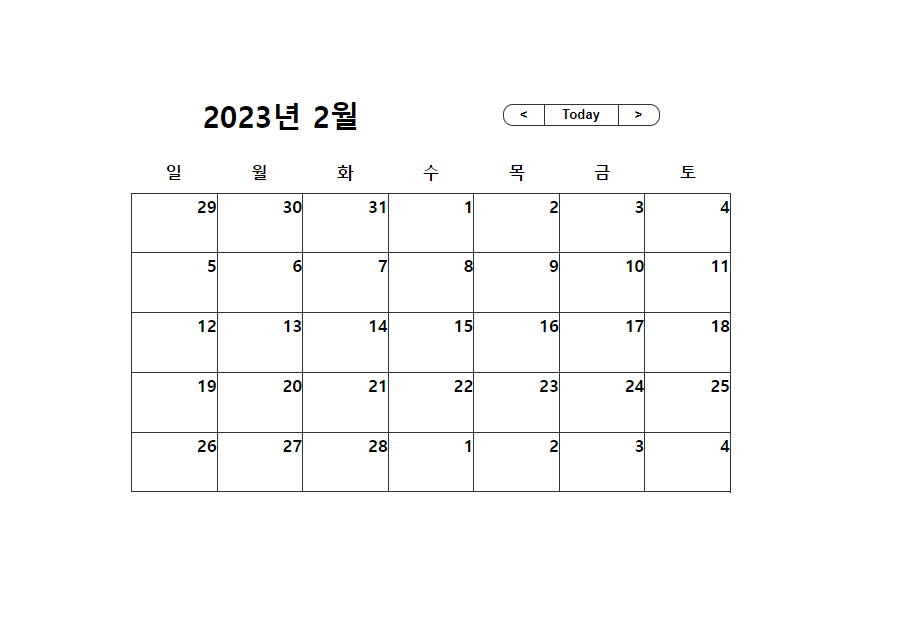

```css
* {
    margin: 0;
    padding: 0;
    box-sizing: border-box;
}

body {
    font-family: "Nunito", sans-serif;
    margin: 0;
    padding: 0;
    height: 100vh;
    width: 100vw;
    border: 1px solid gray;
    display: flex;
    justify-content: center;
    align-items: center;

}


```

+  `*` 를 선택해 전체적인 태그들의 **margin과 padding을 없애준다    

+ 달력을 가운데 정렬하기위해서 `display: flex`    

+ 좌우 가운데 정령을 위해 `justify-content: center`

+ 위아래 가운데 정렬을 위해서 `align-items: center` 

<br>
<br>

```css
.calendar {
  width: 600px;
  margin: 50px;
}
```

캘린더의 크기를 설정 해 줍니다 

<br>
<br>

```css
.header {
    display: flex;
    justify-content: space-around;
    align-items: center;
}

.year-month {
    font-size: 30px;
    font-weight: bold;
}

.nav {
    display: flex;
    border: 1px solid #333333;
    border-radius: 10px;
}
```

+ header안에 있는 날짜와 버튼을 좌우 양쪽 정렬과 상하 가운데 정렬을 해주기 위해서   
   `justify-content: space-around` 와 `align-items: center`를 사용 
   
+ 그리고 버튼을 한줄로 정렬하기 위해서 `flex` 사용 

<br>
<br>

```css
.nav-btn {
    width: 40px;
    height: 20px;
    border: none;
    background-color: transparent;
    cursor: pointer;
    font-weight: bold;
}

.go-today {
    width: 75px;
    border-left: 1px solid #333333;
    border-right: 1px solid #333333;
} 
```

+ `border: none` 사용해 버튼의 선을 제거   
+ `background-color: transparent` 사용해 배경색을 지정하지 않음 

<br>
<br>

```css
.days {
    display: flex;
    margin: 25px 0px 10px;
}

.day {
    font-weight: bold;
    font-size: 17px;
    width: calc(100% / 7);
    text-align: center;
}
```

+ days 클래스에 있는 요일들을 한줄로 정렬하기 위해 `flex`사용 

+ margin : 위 좌우 아래; 속성을 이용해서 margin 값을 줌 

+ 요일은 7개이므로 각 요일의 너비를 같게 하기위해서 **100%/7**의 값을 너비값으로 줌 

<br>
<br> 

```css
.dates {
    display: flex;
    flex-flow: row wrap;
    height: 500px;
    border-top: 1px solid #333333;
    border-right: 1px solid #333333;
}

.date {
    font-weight: bold;
    font-size: 17px;
    width: calc(100% / 7);
    text-align: right;
    border-bottom: 1px solid #333333;
    border-left: 1px solid #333333;
} 

```

+ 각 날짜들의 정렬을 위해서 `display: flex` 를 사용 

+ 아이템들의 자연스러운 줄바꿈을 위해서 `flex-flow: row wrap`을 사용 

+ height를 고정할시 아이템의 갯수에 상관없이    
   주어진 픽셀에 맞춰 자연스운 줄 바꿈을 할 수 있다. 

+ 날짜도 한줄에 7개가 있어야 하므로 **100%/7**의 값을 너비값으로 줌 



### 토요일과 일요일 color 지정하기 


```css
.day:nth-child(7n + 1),
.date:nth-child(7n + 1) {
    color: #D13E3E;
}
```

+  일요일에 해당하는 날짜는 7n+1의 간격으로 days의 자식으로 배치 되어 있는걸    
   알 수 있다.`.day:nth-child(7n + 1)`,`.date:nth-child(7n + 1)` 를 사용해   
   빨간색으로 지정해 주었다

<br>
<br> 

```css
.day:nth-child(7n),
.date:nth-child(7n) {
    color: #396EE2;
}
```

+  토요일에 해당하는 날짜는 7n의 간격으로 days의 자식으로 배치 되어 있는걸    
   알 수 있다. `.day:nth-child(7n + 1)`,`.date:nth-child(7n + 1)` 를 사용해    
   파란색으로 지정해 주었다

<br>
<br>

```css
.other {
    opacity: 0.3;
} 
```

우리가 renderCalendar 함수를 만들때 마지막 부분에 삼항연산자를 이용해 condition의 조건이 참일때 `this` 거짓일때 `other`를 했던 부분이 생각날 것이다.

+  이번달에 해당되지 않는 날짜는 흐릿하게 보여주기 위해서    
   opacity를 통해 투명도를 결정해줌 

<br>
<br>


**우리가 처음에 봤던 달력과 똑같은 결과물이 나오는걸 볼 수 있다**  

**이제 버튼의 기능을 만들어 좀 더 동적인 달력을 만들어 보도록 하자 ->**
