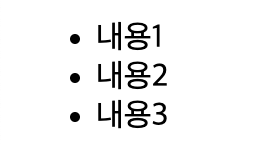
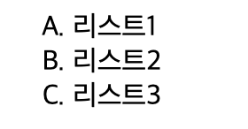
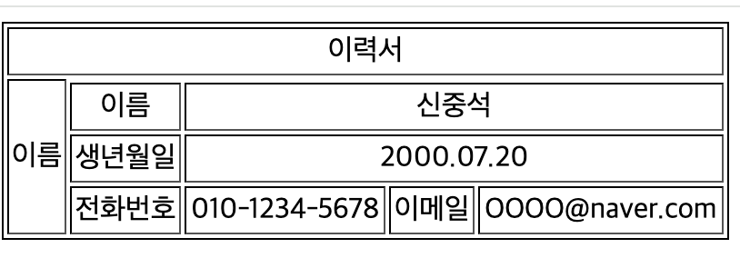
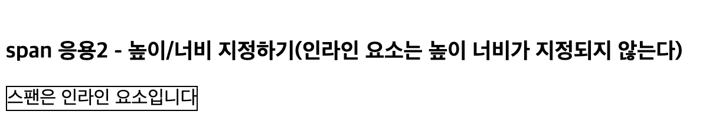

# 목록 관련 태그

## ul (unordered list)

- ul 태그 : li를 감싸는 외부 태그를 순서가 필요 없을때 감쌈<br />
- li 태그 : 실제 컨텐츠를 담는 목록(list) 태그<br />
- 현업에서는 실제 메뉴바(nav-bar)를 표현을 할 때 주로 ul-li로 표현한다.

```html
<ul>
  <li>내용1</li>
  <li>내용2</li>
  <li>내용3</li>
</ul>
```

### 결과



## ol (ordered list)

- ol 태그 : li를 감싸는 외부 태그로 순서가 있을때 활용<br />
- li 태그 : 실제 컨텐츠를 담는 목록(list) 태그<br />
- type 속성: 순서형식을 정하는 것 (기본값: 숫자)
  - a: 영어 소문자로 설정
  - i: 로마자 소문자로 설정
  - I: 로마자 대문자로 설정

```html
<ol type="A">
  <li>리스트1</li>
  <li>리스트2</li>
  <li>리스트3</li>
</ol>
```

### 결과



## table

- 웹 문서에서 table 형태로 자료를 정리하기 위해 사용되는 태그
- 행과 열로 구성되어 있으며, 만나는 지점을 셀이라 한다.
- table 태그 : 테이블을 지칭하는 태그로 가장 밖에 선언된다.
- tr 태그 : 한개의 행(row)을 나타내는 태그
- td 태그 : 한개의 열(column)을 나타내는 태그
- colspan: 열을 병합합는 속성(가로 방향)
- rowspan: 행을 병합하는 속성(세로 방향)
- table에는 style을 속성을 통해 CSS를 적용할 수 있지만 (stylesheet를 만들어 따로 적용하는걸 추천한다)

```html
<table
  border="1"
  style="
        width: 400px;
        height: 120px;
        text-align: center;
        border: 1px solid black;
      "
>
  <tr>
    <td colspan="5">이력서</td>
  </tr>
  <tr>
    <td rowspan="4">이름</td>
  </tr>
  <tr>
    <td>이름</td>
    <td colspan="4">신중석</td>
  </tr>
  <tr>
    <td>생년월일</td>
    <td colspan="4">2000.07.20</td>
  </tr>
  <tr>
    <td>전화번호</td>
    <td>010-1234-5678</td>
    <td>이메일</td>
    <td>OOOO@naver.com</td>
  </tr>
</table>
```



## div

- html문서에서 부분 또는 섹션을 정의하기 위해 블록요소로 활용되는 태그
- 주로 다른 태그를 감싸는 컨테이너(요소안에 요소가 있는 형태)로 활용
- 대표적인 블록태그로 감싸면 한줄이 자동으로 개행 되는 효과 발생 (br)
- 디자인적인 요소는 거의 없는 무색무취 같은 태그 -> css를 적용하는 것이 일반적
- 주로 CSS나 javascript에서 조작하는 단위로 활용됨 -> class, id를 이용해서 조작함

```html
<div
  style="
        border: 1px solid black;
        height: 100px;
        width: 100px;
        text-align: center;
      "
></div>
```

### 결과

_result.png>)

- 추가로 style에 background-color(배경색 지정), text-align(텍스트 정렬) 등의 속성등을 추가해 적용할 수 있다

## span

- 문서의 인라인 요소를 분할할때 사용하는 대표적인 inline 태그<br />
- 주로 inline 영역에 css로 지정하여 영역을 분할 할 때 활용된다.<br />
- div와 같이 id나 class로 속성값을 통해 css를 지정한다.

```html
<span style="border: 1px solid black; height: 100px; width: 300px"> 스팬은 인라인 요소입니다</span>
```

### 결과



- 위와 같이 inline 요소는 높이,너비가 지정되지 않는다.
- 단 style에 **display:inline-block**을 설정해주면 높이와 너비를 설정해 줄 수 있다.

## a

- 페이지에서 a태그로 감싸는 영역을 클릭하면 지정된 페이지로 이동하는 태그
- 외부 사이트 / 같은 도메인 내 이동 / 현재 문서의 특정 위치로도 이동가능

### 외부 사이트 링크 만들기

```html
<a href="http://www.naver.com">네이버로 이동(http 사용)</a>
```

- href: 링크한 페이지의 주소나 id를 입력

### 결과

_result.png>)

- 해당 텍스트를 클릭하게 되면 naver로 이동하게 된다
- 주의사항: http,https를 반드시 붙여 사용해야한다. 그렇지 않으면 같은 도메인 안에서 이동이 되기 때문이다.

### 같은 도메인 내 이동(내부 사이트)

```html
<a href="06_media.html">미디어 예제로 이동</a>
```

- 위와 같이 작성시 도메인 내부에 있는 주소로 이동하게 된다

### 문서 내부 이동(문서 내 특정 영역으로 이동)

```html
<a href="#top">최상단으로 이동</a> <a href="#bottom">최하단으로 이동</a>
```

- top은 id가 없어도 최상단으로 이동하게 된다
- bottom은 id 값이 bottom인 인스턴스로 이동하게 된다 (id는 unique한 값이므로 한개만 존재해야한다)

```toc

```
