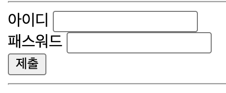
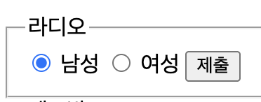
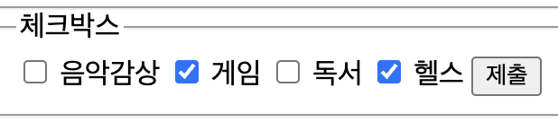
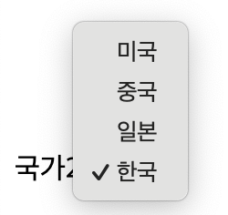

# Form

- 사용자로부터 text 및 각종 입력을 전달받아 page가 지정한 서버로 전달(요청)하는 태그
- 주요한 form : text, pw, textarea, button, summit, radio, select 등

## 주요 Form

주요한 form: text, password, textarea, button, submit 등

```html
<form action="#" method="get" name="formName">
  <label for="userId">아이디</label>
  <input type="text" name="memberId" id="userId" />

  <label for="password">패스워드</label>
  <input type="password" name="password" id="password" />

  <input type="submit" value="제출" />
</form>
```

- action : 전달할 서버의 url, #은 본인의 페이지를 다시 요청하는 방법
- method : 전달할 방식을 선택, get은 url을 통한 노출, post는 url과 별개로 데이터를 전달, 생략하게 되면 디폴트 값은 **get**이지만 명시적으로 표시하는것을 권장한다
- input-id : html 레벨에서 고유의 id를 가지는 속성, 중복될수 없다!
- input-name : form에서 input 파라메터 전달시 사용될 파라메터의 이름,서버에서 활용 (서버에 id의 값이 아닌 name의 값이 전달된다)
- ※ id와 name은 일치하는게 보편적이지만, 다르게 해도 문제는 없다. 각자식별만 잘하면 된다.
- form 요소에 레이블(명칭)을 붙이기 위한 태그 레이블을 클릭하면 입력창으로 커서가 활성화(포커스 상태)된다.
- 레이블 : 입력 창 옆에 붙여 놓는 문구 (예 : 비밀번호, 아이디 등)

### 결과



## button

### input-button type 활용

- 단점: css 적용이 어렵다

```html
<input type="submit" value="제출" />
<input type="button" value="버튼" onclick="alert('버튼클릭');" />
<input type="reset" value="리셋" />
```

### button 태크 활용

- 버튼을 태그로 표현해 활용하는 방법, 기능은 동일하나 css로 활용하기 편리하다

```html
<button type="submit">제출</button>
<button type="button" onclick="alert('버튼 클릭!')">버튼</button>
<button type="reset">리셋</button>
```

## 선택 관련 태그

- radio 버튼은 여러 값 중 하나만 선택해서 단일 값만 선택 가능
- checked: input이 checked 되어 있는 상태로 렌더링된다.

```html
<form action="" method="get">
  <input type="radio" name="gender" id="gender-male" value="m" checked />
  <label for="gender-male">남성</label>

  <input type="radio" name="gender" id="gender-female" value="f" />
  <label for="gender-female">여성</label>

  <input type="submit" value="제출" />
</form>
```

### 결과



## checkBox

- 체크 박스의 경우 다중 값 선택이 가능
- 특징: 여러개의 name을 동시에 보낼 수 있다.(서버에서는 리스트꼴로 처리 필요)

```html
<form action="" method="get">
  <input type="checkbox" name="hobby" id="music" value="music" />
  <label for="music">음악감상</label>

  <input type="checkbox" name="hobby" id="game" value="game" checked />
  <label for="game">게임</label>

  <input type="checkbox" name="hobby" id="book" value="book" />
  <label for="book">독서</label>

  <input type="checkbox" name="hobby" id="health" value="health" checked />
  <label for="health">헬스</label>

  <input type="submit" value="제출" />
</form>
```

### 결과



## select

- 여러 값을 선택할때 활용하는 태그
- value 값이 없으면 표현값(텍스트)이 value로 대체된다
- selected: checked와 비슷하게 해당 옵션이 선택된 상태로 렌더링된다
- select 태그는 반드신 선택 옵션인 option 태그와 같이 사용해야한다

```html
<form action="" method="get">
  <label for="nation2">국가2</label>
  <select name="nation2" id="nation1">
    <option value="us">미국</option>
    <option value="cs">중국</option>
    <option value="jp">일본</option>
    <option value="ko" selected>한국</option>
  </select>
</form>
```

### 결과



# CSS

- css: 웹 페이지에서 디자인을 담당하는 언어

## 기본 문법

```css
div {
  color: red;
  background-color: blue;
}
```

- 선택자: 스타일을 꾸밀 대상을 선택할 수 있는 문장 ( 예시에서는 div )
- 속성: 선택된 요소를 어떤 부분을 스타일링 할지 결정 하는 부분 (위 예시에서는 color, background)
- 속성값 : 정해진 속성에 특정 값을 넣어 디자인 요소를 넣는다 (예시에서는 color의 red, background의 blue)

## 선택자 적용

### 전체 => \*

```css
* {
  color: red;
  background-color: blue;
}
```

### 특정태그 => div, span, h1 등등

```css
div {
  color: red;
}
```

### 아이디 => #아이디값

```css
#id1 {
  color: red;
}
```

### 클래스 => .클래스값

```css
.class1 {
  color: red;
}
```

### 자손 선택자: 선택자 선택자(div 아래 있는 모든 h1에 스타일을 적용한다고 가정)

```html
<div>
  <h1>h1 태그 입니다 1</h1>
  <h1>h1 태그 입니다 2</h1>
  <h1>h1 태그 입니다 3</h1>
  <h1>h1 태그 입니다 4</h1>
  <h1>h1 태그 입니다 5</h1>
</div>
```

```css
div h1 {
  color: red;
}
```

### 자식 선택자: 선택자>선택자,부모-자식의 경우만 가능

```html
<div>
  <h1>h1 태그 입니다</h1>
  <span>span 태그입니다</span>
</div>
```

```css
div > span {
  color: blue;
}
```

- 위와 같이 div 태그 안에있는 span 태그에만 스타일리을 할때 사용된다

### 다중으로 선택하는 경우

#### 특정 태그

```css
div span h1 {
  color: red;
}
```

#### id

```css
#id1 #id2 {
  color: red;
}
```

#### class

```css
.class1 .class2 {
  color: red;
}
```

## CSS 적용 방법

### 내부 스타일 시트

- style 태그를 html 파일 내에서 head, body에 작성하는 방법

### 외부 스타일 시트

- link 태그를 이용하여 css파일을 읽어 와서 스타일 적용하는 방법 (가장 표준적으로 사용하는 방법)

### 인라인 스타일 시트

- 태그 내부에 스타일 정보를 작성하는 방법

```html
<div style="text-align: center;">인라인 스타일 시트</div>
```
