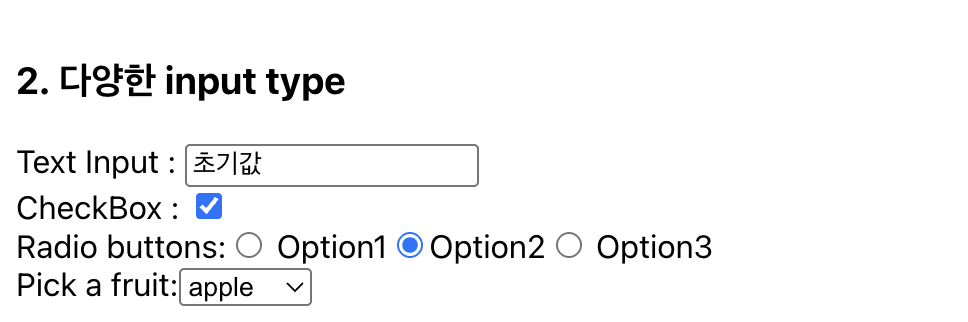
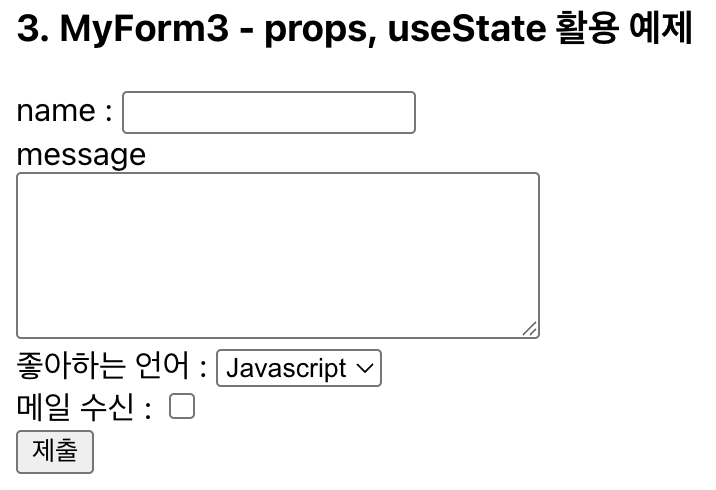

# Form

폼(Form)은 사용자 입력을 처리하는 요소로 React에서는 Form의 특수한 엘리먼트로 구성되어 있다.
Form은 내부적으로 props(formData)와 action 등의 state를 상태 관리하는 요소를 가지고 있고,
사용자는 이를 통해 편리하게 form 처리가 가능하다.

action : URL 혹은 함수를 action을 통해 전달하면, 폼은 HTML 폼 컴포넌트처럼 동작한다. 함수를 action을 통해 전달하면, 해당 함수는 폼 제출을 처리

## Form 기본 예제 - action 활용

```js
export default function MyForm1() {
  function search(formData) {
    const name = formData.get('name');
    const age = formData.get('age');
    const email = formData.get('email');
    alert(`${name}, ${age}, ${email}`);
    const json = Object.fromEntries(formData.entries()); // 리터럴 객체형태로 반환
    console.log(json);
    alert(Object.values(json));
    console.log(formData);
  }

  return (
    <>
      <h3>1. 기본 Form 예제</h3>
      <form action={search}>
        <input name="name" type="text" placeholder="name" defaultValue={'홍길동'} /> <br />
        <input name="age" type="number" placeholder="age" /> <br />
        <input name="email" type="email" placeholder="email" /> <br />
        <button type="submit">submit</button>
      </form>
    </>
  );
}
```

- formData.get()
  - formData에서 name 키의 값을 가져온다.
  - name은 초기 값이 "홍길동"으로 설정되어 있으므로 기본적으로 "홍길동"이 반환된다.
  - age, email은 사용자가 직접 입력한 값을 전달한다.

## 다양한 input type



```js
export default function MyForm2() {
  return (
    <>
      <label>
        Text Input : <input name="myInput" value="초기값" />
      </label>
      <label>
        CheckBox : <input type="checkbox" name="myCheckBox" defaultChecked={true} />
      </label>
      Radio buttons:
      <label>
        <input type="radio" name="myRadio" value="" /> Option1
      </label>
      <label>
        <input type="radio" name="myRadio" value="" defaultChecked={true} />
        Option2
      </label>
      <label>
        <input type="radio" name="myRadio" value="" /> Option3
      </label>
      Pick a fruit:
      <select name="selectedFruit">
        <option>apple</option>
        <option>banana</option>
        <option>grape</option>
      </select>
    </>
  );
}
```

## props와 useState를 통한 form 활용 예제

useState 설계 방법 종류

1.  useState의 정석적인 방법 = 하나씩 선언한다.

- 단점 : 이벤트 함수도 따로 만들어야 한다.

```js
const [name, setName] = useState();
const [message, setMessage] = useState();
```

2.  useState의 응용, 객체로 관리하는 방법

- 장점 : onChange를 한번에 선언할수 있다.

```js
const [formData, setFormData] = useState({}); // 아무 값도 안넣고 초기화 방법
```



```js
import { useState } from 'react';

export default function MyForm3({
  name = '',
  message = '',
  selectLang = 'Javascript',
  checkEmail = false,
}) {
  // state 선언부
  const [formData, setFormData] = useState({
    name,
    message,
    selectLang,
    checkEmail,
  });

  // 입력값 변경 핸들러
  const handleChange = (e) => {
    const { name, value } = e.target;
    const nextFormData = { ...formData, [name]: value };
    setFormData(nextFormData);
  };

  const handleSubmit = (e) => {
    // ajax 처리 코드가 와야하는 자리!
    e.preventDefault();
    alert(Object.values(formData));
    console.log('Form Submitted:', formData);
  };

  return (
    <>
      <form onSubmit={handleSubmit}>
        name : <input name="name" value={formData.name} onChange={handleChange} />
        <br />
        message <br />
        <textarea
          name="message"
          cols={30}
          rows={5}
          value={formData.message}
          onChange={handleChange}
        /> <br />
        좋아하는 언어 :{' '}
        <select name="selectLang" value={formData.selectLang} onChange={handleChange}>
          <option value="C">C</option>
          <option value="C++">C++</option>
          <option value="Java">Java</option>
          <option value="Javascript">Javascript</option>
          <option value="Typescript">Typescript</option>
        </select>
        <br />
        메일 수신 :{' '}
        <input
          name="checkEmail"
          type="checkbox"
          defaultChecked={formData.checkEmail}
          onChange={handleChange}
        />
        <br />
        <input type="submit" value="제출" />
      </form>
    </>
  );
}
```

```toc

```
