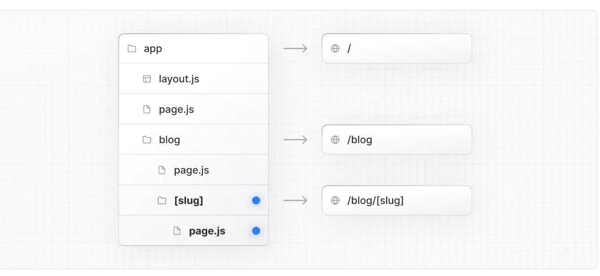
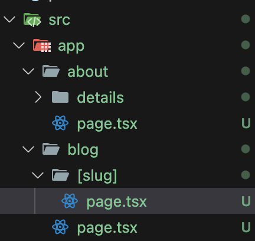
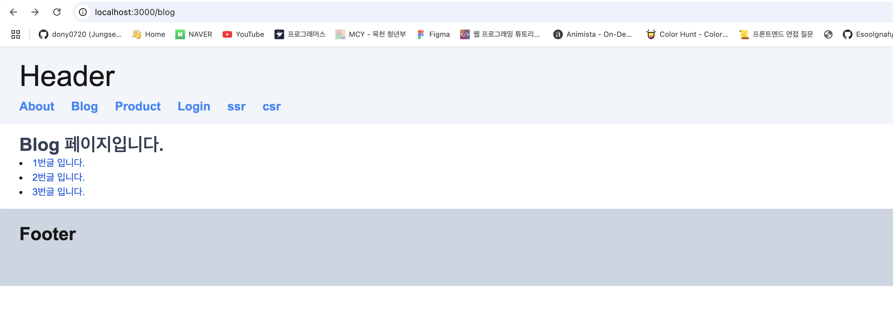
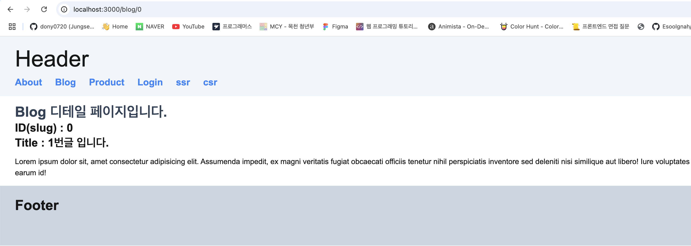
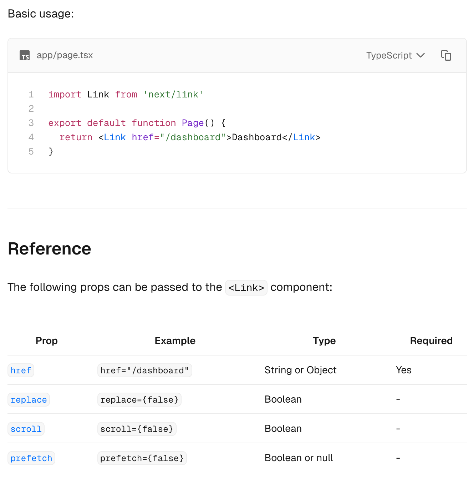

# Next.js란?

Next.js는 React를 기반으로 한 오픈 소스 웹 개발 프레임워크로, 서버사이드 렌더링(SSR), 정적 사이트 생성(SSG),
그리고 클라이언트사이드 렌더링(CSR)을 지원하여 빠르고 효율적인 웹 애플리케이션 개발을 가능하게 한다.
Node.js 위에서 빌드 된 이 프레임워크는 SEO, 성능 최적화, 개발 생산성에서 강력한 기능을 제공하며,
리액트 개발 문서에서 권장하는 툴체인 중 하나로 언급된다. 특히, 서버 렌더링 되는 웹사이트를 빌드하는 데 유용하다.

## 특징

1. **Built-in Optimizations** : 이미지, 폰트, 스크립트 최적화로 성능과 UX 향상시킨다.
2. **Dynamic HTML Streaming** : 서버에서 UI를 스트리밍 방식으로 점진적 렌더링한다.
3. **React Server Components** : 클라이언트 JavaScript를 줄여 성능을 최적화한다.
4. **Data Fetching** : 서버와 클라이언트에서 데이터를 유연하게 가져오는 기능 제공힌다.
5. **CSS Support** : CSS Modules, Tailwind CSS등 다양한 스타일링을 지원한다.
6. **Client and Server Rendering** : CSR, SSR, SSG, ISR을 유연하게 선택 가능하다.
7. **Server Actions** : 서버에서 직접 함수를 호출해 데이터 갱신 및 UI를 업데이트한다.
8. **Route Handlers** : API 엔드포인트를 쉽게 생성하고 외부 서비스와 연결한다.
9. **Advanced Routing & Nested Layouts** : 파일 기반 라우팅과 중첩 레이아웃으로 복잡한 UI 구성을 지원한다.
10. **Middleware** : 요청을 처리하고 인증, 실험, 국제화등을 제어한다.

# Next.js – 라우팅(Routing)

Next.js에서 라우팅(Routing)은 파일 시스템 기반(File-System Based Routing)을 활용한다.
**즉, Next.js는 프로젝트 디렉터리의 pages 폴더 구조를 기반으로 URL 경로를 자동으로 생성한다.**



폴더와 파일의 역할 : 폴더(Folders)는 라우트를 정의하는데 사용된다

- 라우트는 중첩된 폴더의 단일 경로로, 루트 폴더에서 시작하여 page.js 파일을 포함하는 마지막 잎 폴더까지 파일 시스템의 계층 구조를 따른다.
- 파일(Files)은 라우트 세그먼트에 대해 표시될 UI를 생성하는데 사용된다.

## 동적 라우팅(Dynamic Routing)

Next.js에서 동적 라우팅(Dynamic Routing)은 파일 기반 라우팅을 활용하여 구현되며
파일이나 폴더 이름에 대괄호([])를 사용하여 동적 경로를 정의할 수 있다.
이 때 정의된 params는 Promise를 통한 처리나 useParams을 통해 가져올 수 있다.

참고 : https://nextjs.org/docs/app/building-your-application/routing/dynamic-routes

### 예시

#### 폴더 구조



#### blog/page.tsx

```tsx
import Link from 'next/link';
const posts = [
  { id: 0, title: '1번글 입니다.' },
  { id: 1, title: '2번글 입니다.' },
  { id: 2, title: '3번글 입니다.' },
];
export default function Blog() {
  return (
    <>
      <h2 className="text-slate-700 text-3xl font-semibold">Blog 페이지입니다.</h2>
      {posts &&
        posts.map((item) => (
          <li key={item.id}>
            <Link className="text-blue-700 hover:text-blue-400" href={`/blog/${item.id}`}>
              {item.title}
            </Link>
          </li>
        ))}
    </>
  );
}
```



#### blog/[slug]/page.tsx

```tsx
const posts = [
  { id: 0, title: '1번글 입니다.' },
  { id: 1, title: '2번글 입니다.' },
  { id: 2, title: '3번글 입니다.' },
];
export default async function BlogDetail({ params }: { params: Promise<{ slug: string }> }) {
  const slug = (await params).slug;
  const post = posts.find((item) => item.id === Number(slug));
  // console.log(posts);
  return (
    <>
      <h2 className="text-slate-700 text-3xl font-semibold">Blog 디테일 페이지입니다.</h2>
      <div className="text-2xl font-semibold mb-3">
        ID(slug) : {slug} <br />
        Title : {post?.title || '타이틀이 없습니다'}
        <br />
      </div>
      {post && (
        <p>
          Lorem ipsum dolor sit, amet consectetur adipisicing elit. Assumenda impedit, ex magni
          veritatis fugiat obcaecati officiis tenetur nihil perspiciatis inventore sed deleniti nisi
          similique aut libero! Iure voluptates earum id!
        </p>
      )}
    </>
  );
}
```



**주소가 blog/0 이렇게 되어있는걸 볼 수 있다!!!**

## Next.js – <Link>

Next.js에서 Link 컴포넌트는 HTML의 a태그와 같이 클라이언트 사이드 네비게이션을 구현하는 데 사용된다.
해당 컴포넌트를 활용하면 페이지 간 이동이 원활하며, 서버 요청 없이 클라이언트에서 처리되어 성능이 향상된다.

참고 : https://nextjs.org/docs/app/api-reference/components/link



```toc

```
