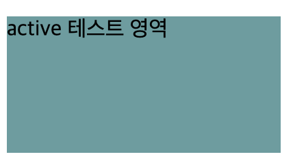
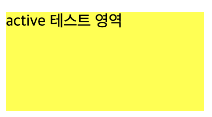
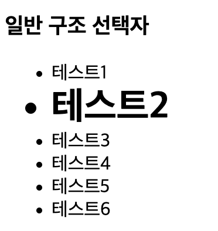
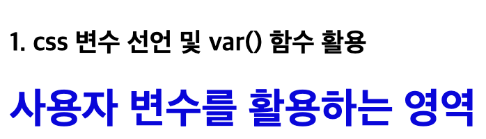

# 반응 선택자

- 사용자의 움직임에 따라 발생하는 이벤트에 반응하는 선택자

## active

```html
<div class="active-test">active 테스트 영역</div>
```

```css
.active-test {
  background-color: cadetblue;
  width: 200px;
  height: 100px;
  margin-bottom: 10px;
}
/* active 상태일때 */
.active-test:active {
  background-color: yellow;
}
```

- active : 사용자가 특정태그를 클릭할때 발생

### active 비활성화



### active 활성화



## hover

```css
.hover-test {
  background-color: yellow;
  width: 200px;
  height: 100px;
  margin-bottom: 10px;
}

/* hover 상태일때 */
.hover-test:hover {
  background-color: yellow;
  text-decoration-line: underline;
  transition: all 1000ms;
}
```

- hover : 사용자가 커서(마우스)를 특정 태그 위에 배치시켰을 때 active와 같은 결과가 나온다

# 상태 선택자

- 입력양식의 상태에 따라 변하는 선택자

## checkbox일 때

```html
<input type="checkbox" name="fruits" id="apple" value="사과" /> <label for="apple">사과</label>
```

```css
input[type='checkbox']:checked {
  width: 50px;
  height: 50px;
}
```

## 결과


- 체크박스를 클릭하면 해당 요소가 활성화 되어서 위 css 스타일을 적용한다

# 일반 구조 선택자

## nth-child( )

- 특정한 위치에 있는 태그 선택(위치로 구분)

```html
<ul id="test1">
  <li>테스트1</li>
  <li>테스트2</li>
  <li>테스트3</li>
  <li>테스트4</li>
  <li>테스트5</li>
  <li>테스트6</li>
</ul>
```

```css
ul > li:nth-child(2) {
  font-size: xx-large;
  font-weight: bold;
}
```

## 결과



## CSS 주요 문법 - 함수

- 변수 선언은 --(원하는 변수명)-(속성) 으로 선언해주면 된다.
- 변수로 선언된 값은 색상, size, 키워드 등 다양한 스타일 값을 선언할 수 있음

```html
<div class="var-item1">사용자 변수를 활용하는 영역</div>
<div>선언된 사용자 변수가 없어 2번째 인자를 활용하는 영역</div>
```

```css
:root {
  --main-color: #0a06e2; /*사용자 컬러 지정*/
  --main-font-size: 30px; /*사용자 font 사이즈 지정*/
  --main-font-weight: bolder; /*사용자 font 굵기*/
}
.var-item1 {
  color: var(--main-color, yellow);
  font-size: var(--main-font-size, 10px);
  font-weight: var(--main-font-weight, lighter);
}
```

- :root 선택자에 변수를 선언후 값을 지정하고 다른 선택자 에서 속성값에 var(root에 선언한 변수명)을 적어주면 해당 값이 적용된다
- 두번째 인자 값인 yellow는 --main-color의 값이 없을 경우 대체된다
- main은 변수명 color은 속성이다
- --main-font-size, --main-font-weight도 동일하다

## 결과



## root 스타일 직접 정의와 변수 선언의 차이점

### root 스타일 직접 정의

```css
:root {
  background-color: blue;
}
```

- 위와 같이 스타일 직접 정의를 하게 될 경우에는 최상위 요소인 html에 스타일이 적용된다

### root에 CSS 변수 선언

```css
:root {
  --main-color: blue; /* 변수 선언만 함 */
}

body {
  background-color: var(--main-color); /* 변수를 호출해야 적용됨 */
}
```

- root에 정의된 --main-color 변수는 값만 적용될 뿐, 특정 요소에 스타일이 적용되지 않는다
- 다른 곳에서 속성값으로 var(--main-color )형태로 호출될 때만 적용된다

```toc

```
