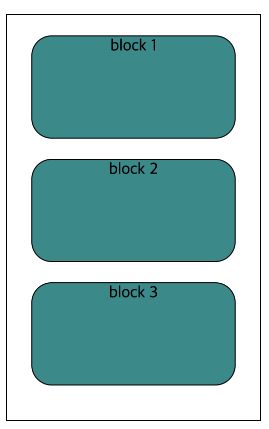
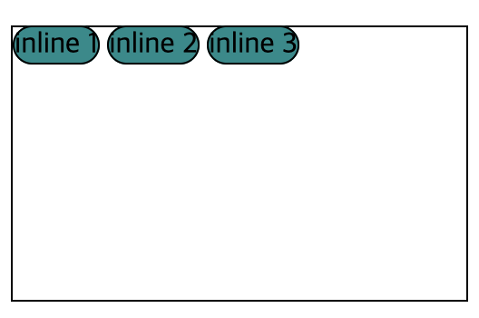
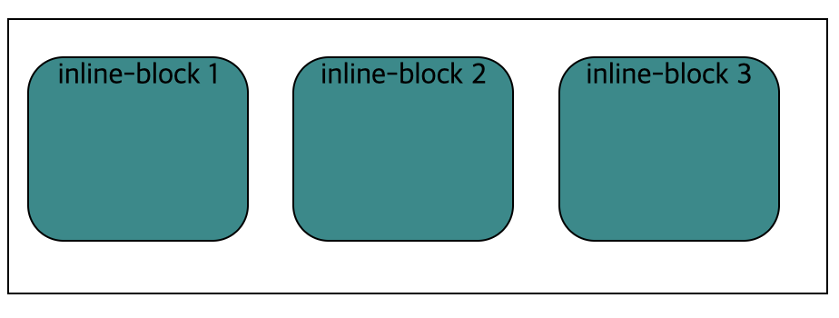

# display

- display 속성 : lnline / block / inline-block / flex / grid 값을 통해
  레이아웃을 배치할때 활용되는 중요 속성
- block : 블록처럼 위아래로 쌓이는 구조를 만들때 사용
- inline : 블록처럼 위아래로 쌓이는 것이 아니라 오른쪽으로 나열할때 사용
- inline-block : inline 요소를 옆으로 block 처럼 쌓아 가로 영역을 확보할 때 사용

## block

```html
<div class="block-container">
  <div class="block">block 1</div>
  <div class="block">block 2</div>
  <div class="block">block 3</div>
</div>
```

```css
.block-container {
  width: 250px;
  height: 400px;
  border: 1px solid black;
  margin-bottom: 20px;
}
.block {
  display: block;
  width: 200px;
  height: 100px;
  margin: auto;
  margin-top: 20px;
  text-align: center;
  border: 1px solid black;
  border-radius: 20px;
  background-color: darkcyan;
}
```

### 결과



- block의 영역은 div 처럼 한 줄을 차지한다
- 즉, 한 요소마다 br(줄바꿈)이 적용된다

## inline

```html
<div class="inline-container">
  <div class="inline">inline 1</div>
  <div class="inline">inline 2</div>
  <div class="inline">inline 3</div>
</div>
```

```css
.inline {
  display: inline;
  width: 200px;
  height: 100px;
  margin: auto;
  margin-top: 20px;
  text-align: center;
  border: 1px solid black;
  border-radius: 20px;
  background-color: darkcyan;
}
.inline-block-container {
  width: 450px;
  height: 150px;
  border: 1px solid black;
  margin-bottom: 20px;
}
```

### 결과



- inline은 span 태그 처럼 텍스트 만큼의 영역을 차지한다고 생각하면 된다
- br(줄바꿈)이 적용되지 않는다
- inline 속성에선는 width, height, margin, padding 속성을 적용되지 않는다

## inline-block

```html
<div class="inline-block-container">
  <div class="inline-block">inline-block 1</div>
  <div class="inline-block">inline-block 2</div>
  <div class="inline-block">inline-block 3</div>
</div>
```

```css
.inline-block-container {
  width: 450px;
  height: 150px;
  border: 1px solid black;
  margin-bottom: 20px;
}
.inline-block {
  display: inline-block;
  width: 120px;
  height: 100px;
  margin: 10px;
  margin-top: 20px;
  text-align: center;
  border: 1px solid black;
  border-radius: 20px;
  background-color: darkcyan;
}
```

### 결과



- inline-block은 width와 height, margin, padding 속성이 적용된다
- 내부적으로는 block의 규칙을 외부적으로는 inline의 규칙을 따르는 하이브리드 모드라고 생각해도 된다

```toc

```
