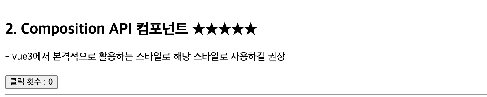

# Vue란?

Vue는 사용자 인터페이스를 구축하기 위한 JavaScript 프레임워크입니다. 이는 표준 HTML, CSS, 및 JavaScript
위에 구축되며, 선언적이고 컴포넌트 기반의 프로그래밍 모델을 제공하여 어떠한 복잡성의 사용자
인터페이스도 효율적으로 개발할 수 있게 도와줍니다.

React와 함께 SPA 개발 도구로 활용 가능한 기술로, React와 유사하게 컴포넌트 기반 개발과 생명주기를
제공하며, React와는 또 다르게 HTML/CSS 친화적인 문법을 통해 상대적으로 간단한 문법을 제공하며,
또한 프레임워크 환경으로 Vue Ecosystem을 활용한 표준적인 아키텍처 스타일을 제공한다.

## Vue의 특징

### 접근성 (Accessibility)

HTML,CSS, 자바스크립트 표준을 기반으로, 쓰기 편한 API와 최고 수준의 문서를 제공합니다. HTML 속성 재사용(@click, @submit ...) 및 보간법 {{...}}을 통한 표현식을 제공하며, Javascript(JSX)가 기반이 되는 Virtual DOM이 아닌 자체 템플릿(html + 디렉티브)으로 구성된 Virtual DOM 구성이 특징이다.

### 성능 (Performance)

제대로 된 반응성, 컴파일러 수준에서 최적화된 렌더링 시스템은 대부분의 경우 개발자가 직접 최적화를
수행할 필요가 없습니다. Virtual DOM 기반의 렌더링을 통해 렌더링 성능을 최적화하며, 기본적으로 VITE 기반으로 프레임워크를 구성함에 있어 빌드 성능과 개발환경 구성, 번들링이 최적화 되어 별도의 라이브러리가 불필요하다.

## Component

### Composition API 컴포넌트

Vue 3.x에서는 Composition API와 &lt;script setup&gt; 구문을 사용하여 컴포넌트를 정의하는 문법이다.

setup에 대해서

- 특정 생명주기로 렌더링 이전의 상태를 의미하며 해당 함수 내부의 영역으로 구현된다.
- 내부에서는 데이터(state) 관련 Hook을 선언 할 수 있으며, 별도의 return이 불필요하다.
- 해당 스타일을 통해 간결하고 직관적인 코드 작성이 가능하며, 상태와 로직을 더욱 명확하게 분리된다.

&lt;script setup&gt; : setup 생명주기 함수 내부를 의미하며, 반응형 상태 데이터나 라이프사이클 등을 표현 가능
&lt;template&gt; : HTML 기반의 템플릿 구조를 정의, 순수 HTML이 아닌 디렉티브(Vue 요소)를 활용(vue2와 동일)

```vue
<script setup>
import { ref } from 'vue';

// 순수 javascript 영역으로 생각하면 편하다.
// 컴포넌트 생명주기인 setup이 실행되는 자리, setup은 마운트 되기 이전 초기 단계이다.

const count = ref(0);
</script>

<template>
  <div>
    <button @click="count++">클릭 횟수 : {{ count }}</button>
  </div>
</template>
```

#### Composition API 컴포넌트 결과



### 인자 전달 - props

- Props : 부모 컴포넌트와 자식 컴포넌트 간의 데이터 전달을 위해 활용되는 속성
- v-bind : vue 전용 디렉티브로서 속성을 전달하는 문법

```vue
// 부모 컴포넌트
<script setup>
import ChildComponent from './ChildComponent.vue';

const parentMessage = 'Hello from parent!';
</script>

<template>
  <div>
    <h2>부모 컴포넌트</h2>
    <p>- 부모 메시지 : {{ parentMessage }}</p>

    <!--자식 컴포넌트로 props 전달하는 방법-->

    <!-- v-bind : 속성을 전달하는 디렉티브(vue 고유속성), 단축 표현도 존재한다. -->
    <ChildComponent v-bind:message="parentMessage" />

    <!-- 단축 표현도 존재한다. -->
    <ChildComponent :message="parentMessage" />

    <!-- props를 직접 전달한다. -->
    <ChildComponent message="Hello from parent!" />
  </div>
</template>

// 자식 컴포넌트
<script setup>
// 부모로부터 전달받은 props 정의하는 방법
defineProps({
  message: String,
});
</script>

<template>
  <div>
    <h3>자식 컴포넌트</h3>
    <p>부모로부터 전달받은 메세지 : {{ message }}</p>
  </div>
</template>
```

#### Props 전달 결과

.png>)

### Composition API LifeCycle

```vue
<script setup>
import {
  onBeforeMount,
  onBeforeUnmount,
  onBeforeUpdate,
  onErrorCaptured,
  onMounted,
  onUnmounted,
  onUpdated,
  ref,
} from 'vue';

const message = ref('안녕하세요? Composition(Vue3) 스타일입니다.');
const count = ref(0);
</script>
```

#### onBeforeMount

DOM이 마운트되기 직전 실행

```vue
onBeforeMount(() => { console.log('2. onBeforeMount : DOM이 마운트 되기 이전', message.value); });
```

#### onMounted

DOM이 마운트된 후 실행 (비동기 통신을 수행할때도 있다.)

```vue
onMounted(() => { console.log('3. onMounted : DOM이 마운트 됨', message.value); });
```

#### onBeforeUpdate

반응형 데이터가 변경되어 DOM이 업데이트되기 직전 실행

```vue
onBeforeUpdate(() => { console.log('onBeforeUpdate : 데이터 변경 감지', count.value); });
```

#### onUpdated

반응형 데이터가 변경되어 DOM이 업데이트된 후 실행

```vue
onUpdated(() => { console.log('onUpdated : DOM에서 데이터 변경이 완료된 이후', count.value); });
```

#### onBeforeUnmount

컴포넌트가 소멸되기 직전 실행

```vue
onBeforeUnmount(() => { console.log('onBeforeUnmount: 컴포넌트 소멸 직전', message.value); });
```

#### onUnmounted

컴포넌트가 소멸된 후 실행

```vue
onUnmounted(() => { console.log('onUnmounted: 컴포넌트 소멸 후', message.value); });
```

#### onErrorCaptured

자식 컴포넌트에서 전파된 에러가 캡쳐 될 때 호출

```vue
onErrorCaptured((err, instance, info) => { console.error('에러 발생!', err, instance, info); });
```

```toc

```
