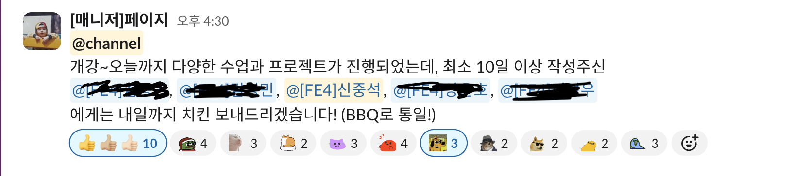

# 프로그래머스 3차 프로젝트

프로그래머스 3차 팀프로젝트는 2차 프로젝트와 똑같이 공공API를 이용해 플랫폼을 만드는 것이다. 다만 이제 Vue.js 환경에서 진행을 해야한다.

## 사전 회의 📝

사전회의에서 브레인 스토밍을 했고 10가지의 주제가 나왔다. 그 중에서 팀원들의 투표를 통해 내가 냈던 유기동물 입얍이 선정됐다.
주제 선정 후에 강사님의 피드백을 받았는데 주제를 냈던 나한테 반려동물을 키우는지 물어보셨다.
한번도 키워보지 않았다는 나의 답변에 어떻게 이 주제가 나올 수 있었는지 의문이 드셨는지 당황의 웃음을 보여주셨다.....ㅋㅋㅋㅋㅋ
추가로 유기동물 입양만으로는 컨텐츠가 적을 수 있어 반려동물 여행도 추가하면 좋겠다는 의견을 주셨다.

## 사전 작업

먼저 figma를 통해서 디자인을 하는데 늘 느끼는 거지만 미적 감각이 없는 나에겐 디자인은 어렵다....
감사하게도 나를 제외한 모든 팀원이 미적 감각이 뛰어나 좋은 결과물을 낼 수 있었던 것 같다.
저번 2차 프로젝트에서는 각자 한 페이지를 맡아 기능까지 진행 했지만
이번에는 공동 컴포넌트 제작 -> 페이지 퍼블리싱 -> API 조회 기능 구현 -> 페이지 기능 이렇게 진행하기로 했다.

## 프로젝트 시작 👨🏻‍💻

이번 프로젝트에서는 Vue.js를 활용해 진행이 되었고. CSS 프레임워크로는 bootstrap을 사용했는데
Tailwind의 편리함을 더 느낄 수 있었다.

### 공동 컴포넌트 만들기

먼저 공동으로 사용되는 컴포넌트들을 제작 했다. 나는 너비와 높이를 props로 줘서 각 페이지에서 원하는 크기를 조절하게 할려고 했는데
오히려 그게 어려움을 갖고 오게 됐다... 그리고 컴포넌트를 확인하기 위해 주었던 margin이 있었는데 작업을 마치고 없애지 않고 push를 해서
해당 컴포넌트를 사용하는 페이지에 가로 스크롤을 만들게 했고 해당 페이지를 작업하던 팀원의 시간을 낭비하게 됐다....
사용하지 않는 속성은 잘 지웠는지 한번 더 확인해보자 라는 귀한 경험을 할 수 있었다.

### 페이지 퍼블리싱

나는 여행 전체 조회 페이지, 입양 커뮤니티 메인 페이지, 마이페이지를 제작했다. 이미지를 일정 비율을 유지한채 특정 영역에 넣는 것이 저번 프로젝트에서
힘들었던 부분인데 다른 팀원들의 코드를 보면서 width, height중에 하나의 속성만 작성하고 object-fit:cover를 사용해 해결 할 수 있었다.

### API 조회 기능 구현

나는 TourAPI에서 공통정보 조회, 소개정보 조회, 키워드 검색 조회를 담당했다. Postman을 통해서 데이터를 불러오는 것을 확인했고
기능을 구현하는 것에 있어서는 어려움이 없었다. 처음 push를 했을때 파일명과 함수명을 같게 하지 않았다는 것을 깨달아서
동일화를 시킨 후에 다시 push했다. 팀장님이 해당 기능을 사용하셨는데 매개변수에 type을 지정해주는 것은 좋은데
return값의 type을 지정해 주지 않은 것이 아쉬웠다는 피드백을 받았고 다음 최종 프로젝트에서는 잊지 않고 잘 적용해야겠다고 생각 할 수 있었다.

### 기능 구현

나는 여행 전체 조회페이지의 기능을 담당했다. 카테고리를 클릭하면 해당 되는 컨텐츠들을 렌더링 해줘야 했다.
처음에는 Props 그 후에는 emit을 활용해봤는데 잘 되지 않아 pinia로 해결 할 수 있었다. 여행 전체 조회 페이지에서만
해당 데이터들이 사용되는데 pinia를 여기에 사용하는 것이 맞는지는 잘 모르겠다.

## 마침 🎬

확실히 프로젝트를 진행하면서 퍼블리싱 작업의 속도는 점점 빨라지는 것을 경험한다. 다만 클린 코드 작성을 하는 것은 늘 어렵다.
기간이 정해져있어 시간에 쫓겨 코드의 퀄리티 보다는 구현하는 것에 초점을 두기 때문이다.
기능을 구현하는 것에 있어서 좀 더 속도가 올라갔으면 한다. 지피티와는 조금 멀어지고 싶기는 하지만 아직 의지하는 부분이 많다..
가족같은 존재다...ㅋㅋㅋㅋㅋㅋ 드디어 마지막 프로젝트만 남았다. 벡엔드 수강생들과 함께 프로젝트를 진행하게 되는데
프론트 팀원 구성도 기존 보다는 적어질 텐데 걱정이 많다... 그래서 방향을 잡아줄 프론트 팀장님을 만났으면 한다.



+추가로 TMI를 더하자면 프로그래머스 교육을 받아오면서 꾸준히 블로그에 글을 올렸는데 생각치 못한 보상을 받았다 🎉🎉🎉  
꾸준히 블로그에 글을 정리했으나 여전히 흡수하지 못한 것들이 있어 더 열심히 해야겠다...!

```toc

```
