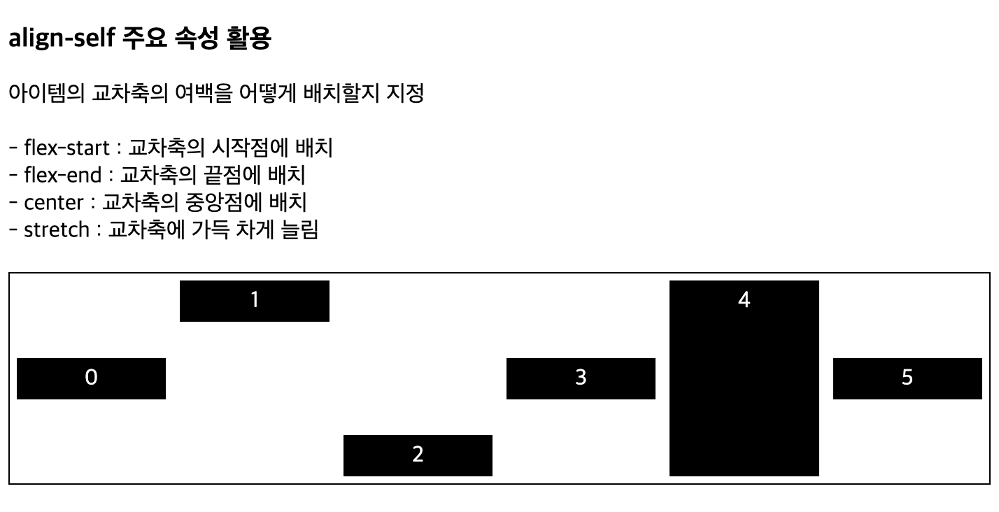
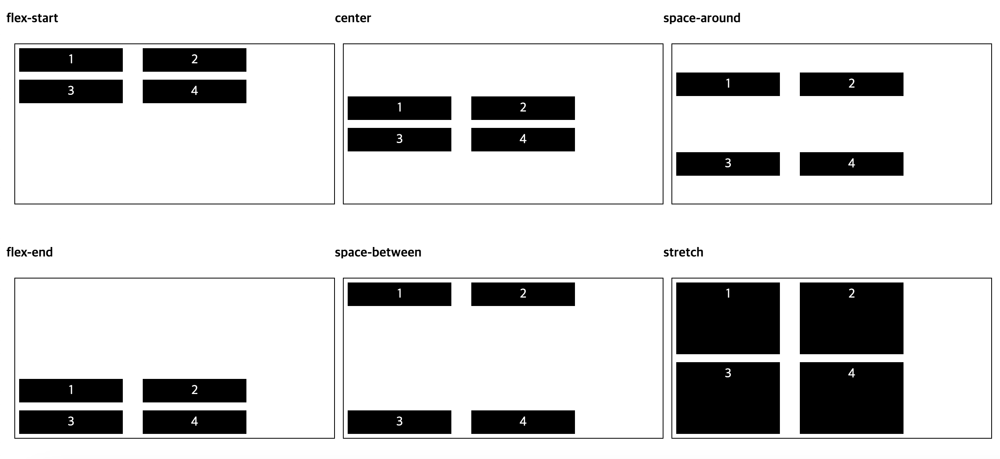
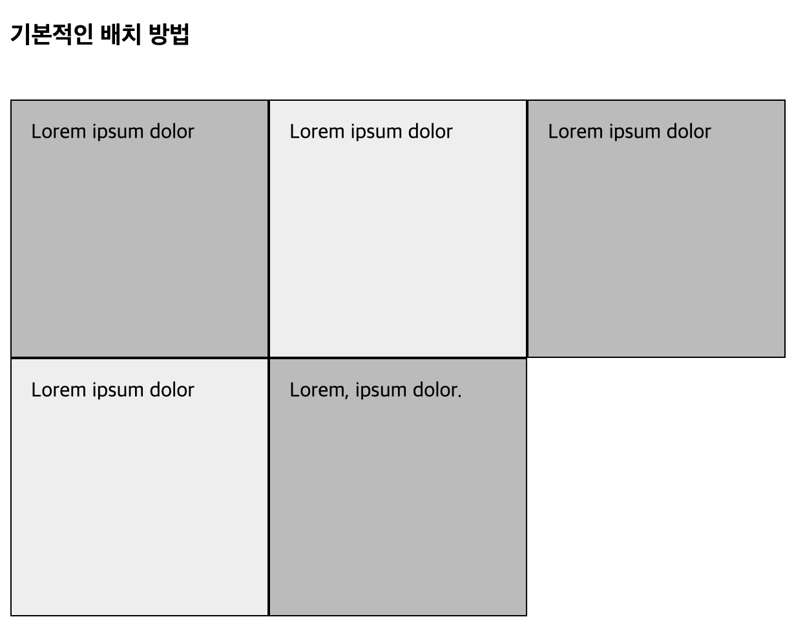
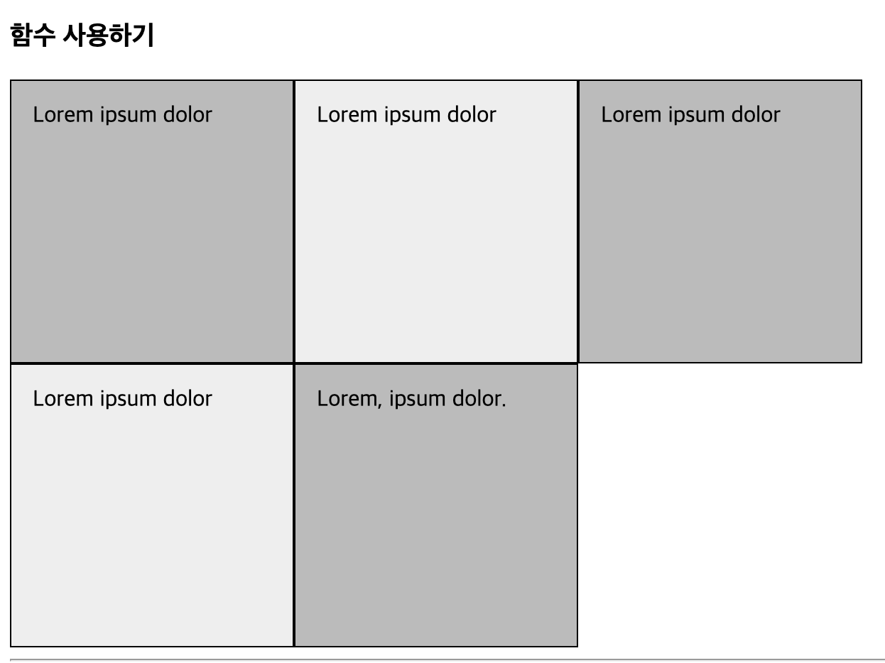

# Flex

## align-self

아이템의 교차축의 여백을 어떻게 배치할지 지정

- flex-start : 교차축의 시작점에 배치
- flex-end : 교차축의 끝점에 배치
- center : 교차축의 중앙점에 배치
- stretch : 교차축에 가득 차게 늘림

```html
<div class="container-self">
  <div class="box">0</div>
  <div class="box alignself1">1</div>
  <div class="box alignself2">2</div>
  <div class="box alignself3">3</div>
  <div class="box alignself4">4</div>
  <div class="box">5</div>
</div>
```

```css
/* item box 스타일링  */
.container-self {
  width: 700px;
  height: 150px;
  display: flex; /* 플렉스 컨테이너 지정 */
  align-items: center; /* 교차축의 중앙에 배치 */
  background-color: white;
  border: 1px solid black;
  margin-bottom: 30px;
}
.container-self .box {
  padding: 5px 45px;
  margin: 5px;
  width: 50px;
  color: white;
  background-color: black;
  text-align: center;
}
/* align-self 속성 적용 */
.alignself1 {
  align-self: flex-start; /* 교차축의 시작점에 배치 */
}
.alignself2 {
  align-self: flex-end; /* 교차축에 가득 차게 늘림 */
}

.alignself3 {
  align-self: center; /* 교차축에 가득 차게 늘림 */
}
.alignself4 {
  align-self: stretch; /* 교차축에 가득 차게 늘림 */
}
```

### align-self 결과



## align-content

item이 여러 줄이 되었을때 item들의 교차축 기준 정렬 방법을 지정

- flex-start : 주축 시작점 기준으로 배치
- flex-end : 주축 끝점 기준으로 배치
- center : 주축 중앙 기준으로 배치
- space-between : 시작점과 끝점 배치 후 중간 항목은 같은 간격으로 배치
- space-around : 전체 항목을 같은 간격으로 배치
- stretch : 항목을 늘려 교차축에 가득 차게 배치

```html
<div class="container8 aligncontent">
  <div class="box">1</div>
  <div class="box">2</div>
  <div class="box">3</div>
  <div class="box">4</div>
</div>
```

```css
.container {
  width: 300px;
  height: 200px;
  display: flex; /* 플렉스 컨테이너 지정 */
  flex-flow: wrap; /* 왼쪽에서 오른쪽, 여러 줄 표시 */
  background-color: white;
  border: 1px solid black;
  margin-bottom: 30px;
  margin-left: 10px;
}
.container > .box {
  padding: 5px 45px;
  margin: 5px;
  width: 40px;
  background-color: black;
  color: white;
  text-align: center;
}

/* 교차축 시작점 기준 */
.aligncontent {
  align-content: flex-start;
}

/* 교차축 끝점 기준 */
.aligncontent {
  align-content: flex-end;
}

/* 교차축 중앙 기준 */
.aligncontent {
  align-content: center;
}

/* 시작점과 끝점 배치 후 중간 항목은 같은 간격으로 배치 */
.aligncontent {
  align-content: space-between;
}

/* 전체 항목을 같은 간격으로 배치 */
.aligncontent {
  align-content: space-around;
}

/* 항목을 늘려 교차축에 가득 차게 배치 */
.aligncontent {
  align-content: stretch;
}
```

### align-content 결과



# Grid

## Grid 기본 배치

- grid-template-columns: 열의 갯수를 표현
- grid-template-rows: 높이를 정하는 방법

```html
<div class="wrapper1">
  <div class="items">Lorem ipsum dolor</div>
  <div class="items">Lorem ipsum dolor</div>
  <div class="items">Lorem ipsum dolor</div>
  <div class="items">Lorem ipsum dolor</div>
  <div class="items">Lorem, ipsum dolor.</div>
</div>

<div class="wrapper2">
  <div class="items">Lorem ipsum dolor</div>
  <div class="items">Lorem ipsum dolor</div>
  <div class="items">Lorem ipsum dolor</div>
  <div class="items">Lorem ipsum dolor</div>
  <div class="items">Lorem, ipsum dolor.</div>
</div>
```

```css
/* gird로 행과 열 지정  */
.wrapper1 {
  display: grid;
  /* 열의 개수 및 너비 지정 */
  grid-template-columns: 200px 200px 200px;
  /* 행의 높이 지정  */
  grid-template-rows: 200px 200px;
}
.wrapper2 {
  display: grid;
  /* 열의 개수 및 너비 지정 */
  grid-template-columns: auto auto auto;
  /* 행의 높이 지정  */
  grid-template-rows: auto auto;
}

/* item 박스 스타일 지정  */
.items {
  border: 1px solid black;
  padding: 10px;
  background-color: white;
}
.items:nth-child(odd) {
  background-color: gray;
}
```

### Grid 기본 배치 결과



## Grid 함수 사용

- repeat : 반복된 값을 넣는 함수, repeat(반복횟수, 반복할 인자)
- fr : 유연한 크기를 갖는 단위, 일정한 비율로 영역을 나눈다고 생각하면 된다
  - (1fr, 1fr, 1fr),repeat(3,1fr) => 3개의 컨텐츠를 1:1:1의 비율로 역영을 나눈다
  - (1fr, 2fr, 1fr) => 1:2:1의 비율로 영역을 나눈다

```html
<div class="wrapper3">
  <div class="items">Lorem ipsum dolor</div>
  <div class="items">Lorem ipsum dolor</div>
  <div class="items">Lorem ipsum dolor</div>
  <div class="items">Lorem ipsum dolor</div>
  <div class="items">Lorem, ipsum dolor.</div>
</div>
```

```css
.wrapper3 {
  width: 600px;
  display: grid;
  grid-template-columns: repeat(3, 1fr);

  grid-template-rows: repeat(2, minmax(100px, auto));

  /* minmax(200px, auto):
    1. 각 행의 최소 높이는 200px로 설정
    2. 각 행의 최대 높이는 auto
    3. auto는 콘텐츠 크기에 따라 행이 커질 수 있음을 의미한다
 */
}
.items {
  border: 1px solid black;
  padding: 10px;
  background-color: white;
}
.items:nth-child(odd) {
  background-color: gray;
}
```

### 함수 사용 결과



```toc

```
