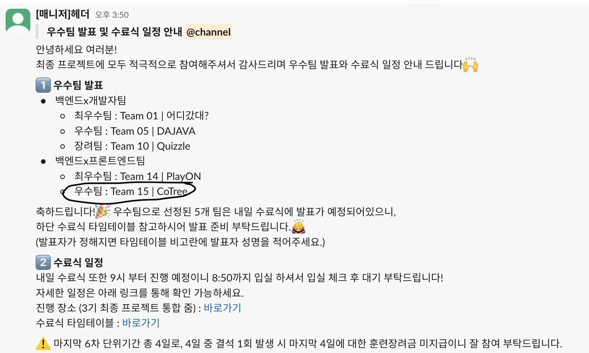

# 프로그래머스 최종 프로젝트

프로그래머스 최종 프로젝트는 벡엔드 수료생들과 협업으로 진행된다. 먼저 3.13(목) ~ 3.14(금) 이틀동안
프론트 팀 내부에서 3인으로 자유롭게 팀원을 구성 후에 원하는 벡엔드 팀에게 연락해 팀 매칭을 통해 진행되는 것이다.
프론트와 매칭이 안된 벡엔드 팀은 벡엔드로만 진행된다고 한다.
나는 팀을 찾지 못하고 있다가 3차 프로젝트 팀원 분의 도움으로 한 명을 기다리고 있는 분들과 함께 하게 되었다.
우리 팀은 비전공자로 이루어진 팀이었는데 비전공자란 틀에 갇혀있지 말고 한번 보여주자고 서로 전의를 다졌다 ㅋㅋㅋㅋㅋ
**팀장은 내가 하겠다고 자원을 했다. 내가 갖고 있는 지식을 나누어 줄 수 있는 경험과
배운것을 얼마나 내 것으로 만들었는지 확인 할 수 있는 좋은 기회였고 자신 있었다.**

## 벡엔드 매칭

주말 동안은 노션에 우리가 원하는 벡엔드 팀의 인재상(?)을 적어 모집 공고를 적었고.
3.10(월) ~ 3.11(화) 이틀 동안 벡엔드 매칭을 완료해야한다. 매칭은 월요일 수업 끝난 후에 시작됐고 감사하게도
많은 팀에서 연락이 왔다. 근데 내가 월요일에 개인적인 일로 바빠서 우리 팀은 저녁 11시부터 시작 했다...!
그렇게 팀원들과 관심이 가는 벡엔드 팀들을 선정 후에 연락을 했고 온라인으로 한번 얘기를 나누고
다음날에 연락을 주시겠다고 했다. 화요일 아침에 매칭이 완료된 팀을 확인해 보니 우리 팀을 제외한 모든
팀들이 매칭을 완료했다고 한다.. 솔직히 조급한 마음이 들었다.. 아침에 슬랙을 켜보니 연락한 벡엔드 팀 모두에게
아쉽지만 다른 팀과 하겠다는 연락이 왔었다... 그래서 나는 다른 벡엔드 팀에게 연락을 취했고
점심시간을 이용해서 서로 이야기를 나눈후에 매칭을 완료했다...(후...)
얘기를 나누면서 벡엔드 팀원 분들이 되게 밝으셔가지고 소통하는데 어려움이 없을거 같고 좋은 느낌이 들었다.

## 사전 회의 📝

브레인 스토밍을 한 결과 우리 팀은 다양한 모임을 위한 서비스를 만들기로 했다.
그리고 강사님께 피드백을 받았는데 주제가 너무 뚜렷하지 않고 중복되고 애매한 것들이 있다고 해서
다시 생각해보라고 하셨다.. 다시 생각을 해본 결과 개발자를 위한 역량 강화 플랫폼을 만들기로 했다.
개발 관련 교육 제공, 헤드헌팅 채용 서비스, 사이드 프로젝트 모집이 주 기능이다.
강사님 주제 되게 좋다고 하셨는데 프론트가 난이도가 있다고 하셨다. 더군다나 기존의 프로젝트는
프론트 5명이서 진행했는데 이제는 3명이기 때문이다. 이제 시간을 얼마나 갈아 넣느냐가 관건인것 같다.

## 사전 작업

### 디자인

벡엔드 분들은 피그마를 거의 다루시지 않으셔서 프론트와 벡엔드 디자인 작업은 참고할만 웹 페이지 조사,
컴포넌트 캡쳐까지 진행 하기로 했다. 감사하게도 좋은 자료들을 찾아와 주셨고 벡엔드와 프론트 따로 나뉘어서 필요한 작업들을 하기로 했다.
프론트는 웹페이지 디자인을 작업해야 했고 캡쳐본으로 붙인 디자인을 수작업 했다.

### 프로젝트 세팅 👨🏻‍💻

이번 프로젝트에서는 React + Vite를 활용해 진행이 되었고. CSS 프레임워크로는 tailwind, shadcn/ui를 사용하기로 했고
Ts를 사용할 생각이었는데 팀원 분들이 ts를 어려워 하셔서 아쉽지만 Js로 사용하기로 했다.

### 벡엔드 협업

벡엔드 팀은 페이지 디자인 하나를 완료할때마다 디자인을 보고 필요한 데이터를 구조화 시켰다.
디자인 작업이 끝난 후에는 해당 페이지에서 필요한 데이터와 기능의 흐름을 체크했다.

## 프로젝트

드디어 디자인 + 프로젝트 세팅이 완료됐다. 이제 프론트는 퍼블리싱 작업, 벡엔드는 명세러를 작성하는 작업을 진행했다.

### 공동 컴포넌트 만들기

우리는 공동 컴포넌트를 정리 했고 width, height, data는 다르지만 기능의 역할이 같다면 컴포넌트에
속성으로 전달 할 수 있게 컴포넌트를 만들었다. 초반 공동 컴포넌트 작업량이 있어 시간이 걸렸지만 팀원들의 열정으로
하루만에 마쳤다 .

### 페이지 퍼블리싱

공동 컴포넌트를 작성해둔 페이지를 퍼블리싱 할때의 속도는 꽤 빨랐다. 마치 퍼즐처럼 차차차 되는 느낌이
너무 재미있었다. 페이지 퍼블리싱 작업은 약 1주일 예상했다. 기능 개발을 기간을 최대한 빨리 가져가야 된다는 생각뿐이었다.
강한 목표의식이 생겨서 더 불을 붙여 퍼블리싱 작업을 한 덕분에 5일만에 퍼블리싱을 마칠 수 있었다.

### 기능 구현

나는 채용 리스트 조회 페이지, 이력서 작성 페이지, 이력서 상세 조회 페이지, 프로젝트 조회 페이지, 프로젝트 생성 페이지를 담당했다.
어려웠던 부분은 작성 페이지에서 prop drilling으로 인해 해당 값들을 최상단으로 가져와서 post 해줘야 하는 것이 조금 귀찮았다.
zustand로 해결할까 생각했었는데 해당 데이터가 한 페이지에서만 사용되는데 prop drilling으로 인해 사용한다는 것은
옳지 않다고 판단했고 state변경 함수를 상속 해주는 것을 택했다.

### 개발 이슈

이력서 작성 담당 벡엔드 팀원 분과 약간의 소통 이슈가 있었다. 개발 직무를 값은 post 해주는 값을
나는 입력 폼의 값을 그대로 post 할려고 했는데 벡엔드 팀원 분은 개발 직무 api를 받아온 후에
해당 직무를 select를 하면 해당 직무의 id 값을 post 하는 방식으로 생각한 것이다.
벡엔드 팀원 분에게 로직 변경이 가능하냐고 여쭤 봤는데 지금은 많이 어렵다고 해서
프론트에서 디자인과 로직을 변경하는 것으로 결정했다. 프론트에서는 약간의 시간을 소모해야 하지만 크게 벗어나는 정도가 아니기에 다행이었다.
소통의 오류는 프로젝트의 진척과 늦어질 수 있겠다고 생각을 할 수 있었다. 그니까 초반 사전작업이 지루하더라도 시간과 노력을 갈아넣자..! 😂

## 프로젝트 마침 😌

프로젝트는 배포까지 잘 마칠 수 있었다. 평가 방식은 배포된 서비스를 보고 벡엔드 + 프론트엔드 약 90명의 교육생의 투표와 강사님들의 점수를
합산해 벡엔드만 이루어진 팀에서는 최우수팀, 우수팀, 장려팀이 선정되고 프론트 x 벡엔드 이루어진 팀에서는 최우수팀, 우수팀을 선정한다.
투표결과는 다음날 오후에 발표된다. 그동안 나도 배포된 서비스들 경험하는데 정말 다들 잘 하셨다.
AI로 퀴즈를 생성하고 생성된 방에서 함께 퀴즈를 푸는 서비스가 있었는데
팀원들과 함께 해봤는데 재미있었다 ㅋㅋㅋㅋ 약간의 근데 문제를 풀지 않았는데 문제가 넘어가는 이슈가 있어서 아쉬웠다.

## 결과


우리 팀은 우수팀으로 선정이 됐다~~~ (감사합니다 주님 🙏🙏) 결과를 보고 정말 짜릿했다... 여태까지 노력해온 것이 헛된게 아니란
증거고 열심히 노력한 보상이라 생각된다. 결과 발표 전날 약간의 전조증상 같은게 보였다.
프로젝트 종료 후 저녁에 강사님이 우리팀 서비스 정말 완성도가 좋다고 우수팀으로 선정될 수 있으니 서비스에 들어가는 컨텐츠들을 좀 더 챙기라는 말씀,
그리고 결과 당일 새벽에 서비스 배포링크와 함께 제출한 발표PPT 피드백을 DM 주셔서 약간의 기대감을 가지고 있었다 ㅋㅋㅋㅋ

## 마무리 🎬

3차 프로젝트 전에 걱정한 것들이 있었는데 잘 마무리 되었다. 좋은 벡엔드 팀을 만났고 좋은 프론트 팀장을 만나 실력이 늘기를 소망했는데
결론적으로 팀장을 맡아서 실력이 늘 수 있었다 ㅋㅋㅋㅋㅋ 이제 마지막이라 약간 시원섭섭하다.
그래도 슬랙도 그대로 있고 글 작성하는 오늘 우리 수료생들만 있는 디코 채널도 생겼다!!
그래서 커뮤니티를 잘 활용해보고자 한다. 이제 해이해지지 않고 취업만 목표로 삼고 도전해야겠다.


- 추가로 만약에 최우수팀 or 우수팀으로 선정될 수 있으니 발표자 정하는 우리 귀여운 팀원들 ㅋㅋㅋㅋㅋㅋㅋ
  뭐로 정하지 고민하다 Marble Roulette으로 정하는데 내가 될까봐 긴장했다...

```toc

```
