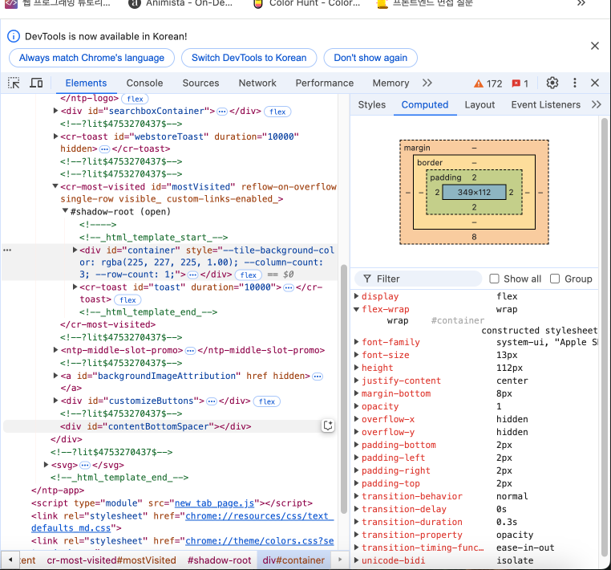
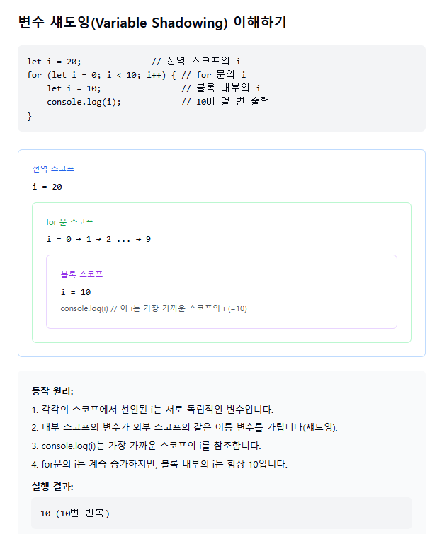

# 개발자 도구

개발자 도구(Developer Tools)는 웹 브라우저에 내장된 도구 모음으로, 웹페이지의 디버깅, 수정, 프로파일링 등의 작업을 수행하는 데 사용되며, 웹 개발자들이 웹 애플리케이션을 개발하고 디버깅하는 데 도움을 주는 ‘강력한 도구’입니다.

## Elements 패널


출처: <https://velog.io/@remon/%EA%B0%9C%EB%B0%9C%EC%9E%90-%EB%8F%84%EA%B5%AC%EC%9D%98-%EA%B8%B0%EB%8A%A5%EC%9D%84-%EB%9C%AF%EC%96%B4%EB%B3%B4%EC%9E%90>

- 웹페이지의 구성과 CSS를 알 수 있다
- HTML 코드 분석 및 실시간으로 레이아웃과 디자인을 변경할 수 있다
- 해당 속성 값을 직접 타이핑 해서 속성값을 변경할 수 있다

### styles 순서의 의미

- 가장 상단부터 css파일의 우선수위에 따라 나옵니다. 제일 먼저 뜨는 스타일이 우선순위가 가장 높습니다.
- 취소선은 그어진 CSS는 우선순위에 밀려서 적용되지 않은 값들이다

### computed



- styles는 적용되지 않은 속성들도 보여주지만 여기서는 적용된 스타일만 보여준다
- content, padding, border, margin 의 값을 알 수 있다
- Group을 체크 하게 되면 Layout, Text, Appearance, Other 그룹으로 나누어 속성을 나타낸다

## console 패널


- 자바스크립트 코드를 즉시 실행할 수 있다
- 프론트엔드 개발자는 디버깅, 백엔드 개발자는 response(에러 메세지,status 코드)도 console.log()를 통해 확인 가능하다

## Application 패널


- Session Storage: 해당 탭이 종료되면 Session Storage에 저장된 값들은 사라진다
- Local Storage: 사용자가 데이터를 지우지 않는 이상 해당 브라우저에 계속 값이 남아 있음
- Cookies: 해당 웹 사이트에 저장된 쿠키 값을 볼 수 있음
- Cookie: HTTP의 일종으로 사용자가 어떤 웹 사이트를 방문할 경우, 해당 사이트가 사용하고 있는 서버에서 사용자의 컴퓨터에 저장하는 작은 기록 정보 파일이다. HTTP에서 클라이언트의 상태정보를 쿠키 형태로 클라이언트 PC에 저장하였다가 필요 시 정보를 참조하거나 재사용할 수 있다.

## Network 패널


웹사이트에서 통신하고 있는 모든 정보를 목록으로 보여줍니다.

- Fetch/XHR : API 정보를 확인할 수 있습니다. (API의 request(호출), response(결과)를 확인할 때 사용합니다.)
- Name : 리소스의 이름과 URL 표시
- Status : 작동 여부 표시 ( 200: 정상작동 )
- Type : 파일의 형식
- Initiator : 요청을 발생시킨 코드 표시 (클릭하면 코드로 이동)
- Size : 리소스들의 파일 사이즈
- Time : 요청과 응답까지 걸린 시간 확인

### API 데이터 찾아보기


- Status Code: 200의 의미는 데이터가 정상적으로 불러와졌다는걸 의미한다
- Request url: 웹페이지가 서버에 요청하는 url

# for 반복문

## 변수 쉐도잉 (variable shadowing)

스코프 안에서 이미 밖에 선언 되어있던 같은 이름의 변수를 사용하는 경우,
스코프 밖의 변수는 잠시 가려지게(shadowing) 됩니다.



```toc

```
