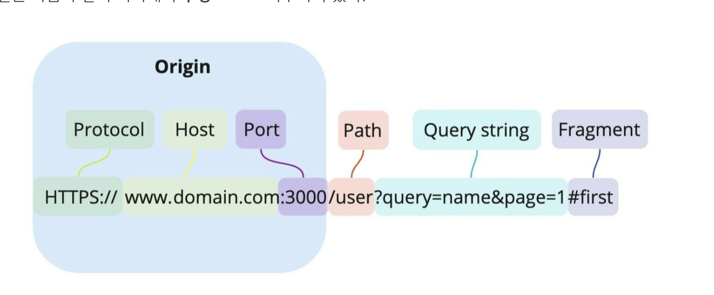
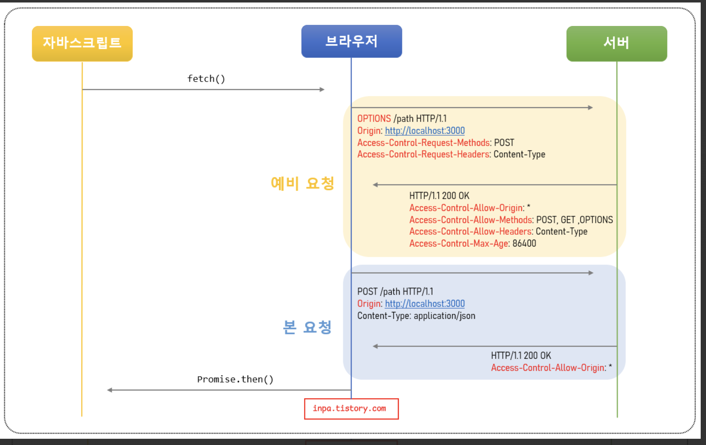
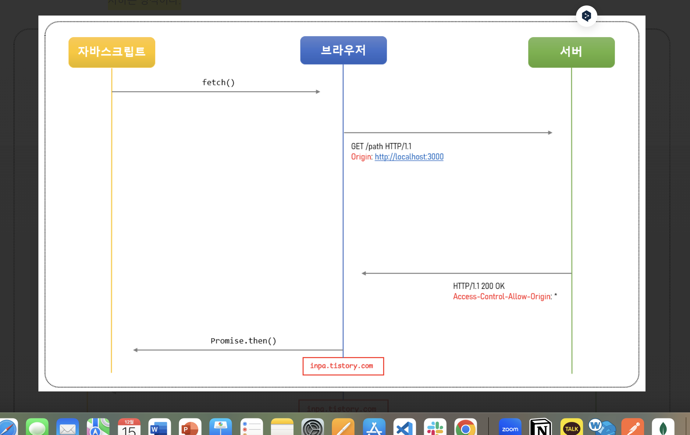
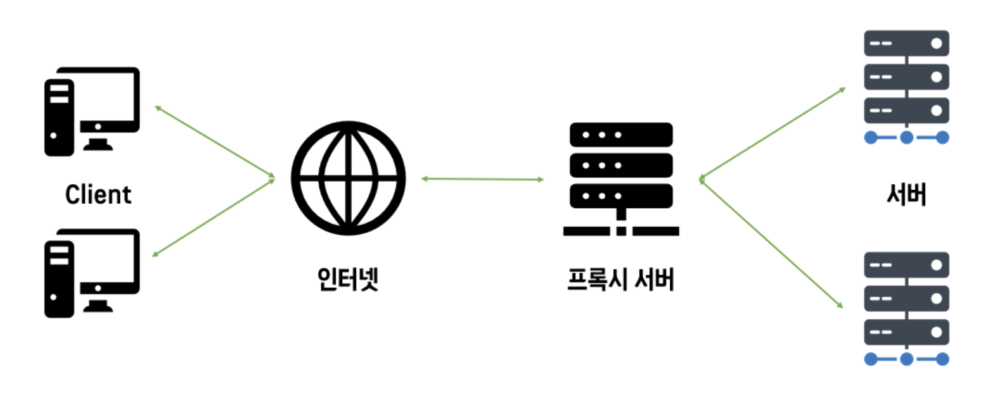

# CORS란?

CORS(Cross-Origin Resource Sharing)는 웹 브라우저가 **다른 출처(Origin)** 의 리소스에 접근할 때 발생할 수 있는 보안 정책을 제어하기 위한 메커니즘입니다.

웹 브라우저는 기본적으로 보안상 같은 출처(Same-Origin)에서만 리소스를 요청하도록 설계되었습니다.
하지만 실제로 다양한 API 호출이나 외부 리소스 사용을 위해 다른 출처의 리소스를 요청해야 할 경우가 많습니다.
이때, CORS 정책을 통해 안전하게 리소스에 접근할 수 있도록 허용 여부를 설정할 수 있습니다.

## 출처(Origin)란?

URL은 https://domain.com:3000/user?query=name&page=1 과 같이 하나의 문자열 같지만, 사실은 다음과 같이 여러개의 구성 요소로 이루어져 있습니다.



- Protocol(Scheme) : http, https
- Host : 사이트 도메인
- Port : 포트 번호
- Path : 사이트 내부 경로
- Query string : 요청의 key와 value값
- Fragment : 해시 태크

Origin : Protocol + Host + Port

즉, 출처(Origin) 라는 것은 Protocol 과 Host 그리고 Port 까지 모두 합친 URL을 의미한다고 보면 됩니다

## Cross-Origin 판단 기준

두 개의 출처가 서로 같다고 판단하는 로직은, 두 URL의 구성 요소 중 Scheme(프로토콜), Host(도메인), Port, 이 3가지만 동일하면 된다고 합니다.이 3가지 중 하나라도 다르면 cross-origin 입니다.

다음은 https://www.domain.com:3000 출처에 대한 여러 URL에 따른 동일 출처 비교 표 입니다.

```
비교 URL => https://www.domain.com:3000 
```

| url                                             | 동일 출처 | 이유                             |
| ----------------------------------------------- | --------- | -------------------------------- |
| https://www.domain.com:3000/about               | yes       | 프로토콜, 호스트, 포트 번호 동일 |
| https://www.domain.com:3000/about?username=inpa | yes       | 프로토콜, 호스트, 포트 번호 동일 |
| http://www.domain.com:3000                      | no        | 프로토콜 다름 (http ≠ https)     |
| https://www.another.co.kr:3000                  | no        | 호스트 다름                      |
| https://www.domain.com:8888                     | no        | 포트 번호 다름                   |
| https://www.domain.com                          | no        | 포트 번호 다름 (443 ≠ 3000)      |

## CORS의 동작

### Preflight Request (사전요청)

사실 브라우저는 요청을 보낼때 한번에 바로 보내지않고, 먼저 예비 요청을 보내 서버와 잘 통신되는지 확인한 후 본 요청을 보낸다. 
즉, 예비 요청의 역할은 본 요청을 보내기 전에 브라우저 스스로 안전한 요청인지 미리 확인하는 것이다.

이때 브라우저가 예비요청을 보내는 것을 Preflight라고 부르며, 이 예비요청의 HTTP 메소드를 GET이나 POST가 아닌 OPTIONS라는 요청이 사용된다는 것이 특징이다.



1. 자바스크립트의 fetch() 메서드를 통해 리소스를 받아오려고 합니다.

2. 브라우저는 서버로 HTTP OPTIONS 메소드로 예비 요청(Preflight)을 먼저 보냅니다.

   - Origin 헤더에 자신의 출처를 넣습니다.
   - Access-Control-Request-Method 헤더에 실제 요청에 사용할 메소드를 설정합니다.
   - Access-Control-Request-Headers 헤더에 실제 요청에 사용할 헤더들을 설정합니다.

3. 서버는 이 예비 요청에 대한 응답으로 어떤 것을 허용하고 어떤것을 금지하고 있는지에 대한 헤더 정보를 담아서 브라우저로 보내줍니다.

   - Access-Control-Allow-Origin 헤더에 허용되는 Origin들의 목록을 설정합니다.
   - Access-Control-Allow-Methods 헤더에 허용되는 메소드들의 목록을 설정합니다.
   - Access-Control-Allow-Headers 헤더에 허용되는 헤더들의 목록을 설정합니다.
   - Access-Control-Max-Age 헤더에 해당 예비 요청이 브라우저에 캐시 될 수 있는 시간을 초 단위로 설정합니다.

4. 이후 브라우저는 보낸 요청과 서버가 응답해준 정책을 비교하여, 해당 요청이 안전한지 확인하고 본 요청을 보내게 된다.
5. 서버가 본 요청에 대한 응답을 하면 최종적으로 이 응답 데이터를 자바스립트로 넘겨줍니다.

### 단순 요청 (Simple Request)

단순 요청은 말그대로 예비 요청(Prefilght)을 생략하고 바로 서버에 직행으로 본 요청을 보낸 후, 서버가 이에 대한 응답의 헤더에 Access-Control-Allow-Origin 헤더를 보내주면 브라우저가 CORS정책 위반 여부를 검사하는 방식이다.



대표적으로 아래 3가지 경우를 만족 할때 만 가능하다.

1. 요청의 메소드는 GET, HEAD, POST 중 하나여야 합니다.
2. Accept, Accept-Language, Content-Language, Content-Type, DPR, Downlink, Save-Data, Viewport-Width, Width 헤더일 경우 에만 적용됩니다.
3. Content-Type 헤더가 application/x-www-form-urlencoded, multipart/form-data, text/plain중 하나여야 합니다. 아닐 경우 예비 요청으로 동작됩니다.

이처럼 다소 까다로운 조건들이 많기 때문에, 위 조건을 모두 만족되어 단순 요청이 일어나는 상황은 드물다고 보면 됩니다.

왜냐하면 대부분 HTTP API 요청은 text/xml 이나 application/json 으로 통신하기 때문에 3번째 Content-Type이 위반되기 때문입니다.

**따라서 대부분의 API 요청은 그냥 예비 요청(preflight)으로 이루어진다 라고 이해하면 됩니다.**

### 인증된 요청 (Credentialed Request)

인증된 요청은 클라이언트에서 서버에게 자격 인증 정보(Credential)를 실어 요청할때 사용되는 요청입니다.

여기서 말하는 자격 인증 정보란 세션 ID가 저장되어있는 쿠키(Cookie) 혹은 Authorization 헤더에 설정하는 토큰 값 등을 일컫습니다.

#### 1. 클라이언트에서 인증 정보를 보내도록 설정하기

기본적으로 브라우저가 제공하는 요청 API 들은 별도의 옵션 없이 브라우저의 쿠키와 같은 인증과 관련된 데이터를 함부로 요청 데이터에 담지 않도록 되어있습니다.

이때 요청에 인증과 관련된 정보를 담을 수 있게 해주는 옵션이 바로 credentials 옵션이다. 이 옵션에는 3가지의 값을 사용할 수 있습니다.

| 옵션 값             | 설명                                                |
| ------------------- | --------------------------------------------------- |
| same-origin(기본값) | 같은 출처 간 요청에만 인증 정보를 담을 수 있습니다. |
| include             | 모든 요청에 인증 정보를 담을 수 있습니다.           |
| omit                | 모든 요청에 인증 정보를 담지 않습니다.              |

```js
// fetch 메서드
fetch('https://example.com:1234/users/login', {
  method: 'POST',
  credentials: 'include', // 클라이언트와 서버가 통신할때 쿠키와 같은 인증 정보 값을 공유하겠다는 설정
  body: JSON.stringify({
    userId: 1,
  }),
});

// axios 라이브러리
axios.post(
  'https://example.com:1234/users/login',
  {
    profile: { username: username, password: password },
  },
  {
    withCredentials: true, // 클라이언트와 서버가 통신할때 쿠키와 같은 인증 정보 값을 공유하겠다는 설정
  },
);
```

#### 2. 서버에서 인증된 요청에 대한 헤더 설정하기

서버도 마찬가지로 이러한 인증된 요청에 대해 일반적인 CORS 요청과는 다르게 대응해줘야 합니다.

1. 응답 헤더의 Access-Control-Allow-Credentials 항목을 true로 설정해야 합니다.
2. 응답 헤더의 Access-Control-Allow-Origin 의 값에 와일드카드 문자("\*")는 사용할 수 없습니다.
3. 응답 헤더의 Access-Control-Allow-Methods 의 값에 와일드카드 문자("\*")는 사용할 수 없습니다.
4. 응답 헤더의 Access-Control-Allow-Headers 의 값에 와일드카드 문자("\*")는 사용할 수 없습니다.

즉, 응답의 Access-Control-Allow-Origin 헤더가 와일드카드(\*)가 아닌 분명한 Origin으로 설정되어야 하고, Access-Control-Allow-Credentials 헤더는 true로 설정되어야 한다는 뜻이다. 그렇지 않으면 브라우저의 CORS 정책에 의해 응답이 거부됩니다.

## CORS 해결 방법

### 1. Chrome 확장 프로그램 이용

Allow CORS: Access-Control-Allow-Origin' 크롬 확장 프로그램을을 설치 해줍니다.

그러면 브라우저 오른쪽 상단에서 확장 프로그램을 활성화 시킬 수 있습니다. 해당 프로그램을 활성화 시키게 되면, 로컬(localhost) 환경에서 API를 테스트 시, CORS 문제를 해결할 수 있습니다.

### 2. 프록시 사이트 이용하기

프록시(Proxy)란 클라이언트와 서버 사이의 중계 대리점이라고 보면 됩니다.

즉, 프론트에서 직접 서버에 리소스를 요청을 했더니 서버에서 따로 설정을 안해줘서 CORS 에러가 뜬다면, 모든 출처를 허용한 서버 대리점을 통해 요청을 하면 되는 것입니다.



다만 현재 무료 프록시 서버 대여 서비스들은 모두 악용 사례 때문에 api 요청 횟수 제한을 두어 실전에서는 사용하기 무리입니다. 따라서 테스트용이나 맛보기용으로 사용하되, 실전에서는 직접 프록시 서버를 구축하여 사용하여야 합니다.

### 3. 서버에서 Access-Control-Allow-Origin 헤더 세팅하기

직접 서버에서 HTTP 헤더 설정을 통해 출처를 허용하게 설정하는 가장 정석적인 해결책입니다.

```
# 헤더에 작성된 출처만 브라우저가 리소스를 접근할 수 있도록 허용함.
# * 이면 모든 곳에 공개되어 있음을 의미한다.
Access-Control-Allow-Origin : https://naver.com

# 리소스 접근을 허용하는 HTTP 메서드를 지정해 주는 헤더
Access-Control-Request-Methods : GET, POST, PUT, DELETE

# 요청을 허용하는 해더.
Access-Control-Allow-Headers : Origin,Accept,X-Requested-With,Content-Type,Access-Control-Request-Method,Access-Control-Request-Headers,Authorization

# 클라이언트에서 preflight 의 요청 결과를 저장할 기간을 지정
# 60초 동안 preflight 요청을 캐시하는 설정으로, 첫 요청 이후 60초 동안은 OPTIONS 메소드를 사용하는 예비 요청을 보내지 않는다.
Access-Control-Max-Age : 60

# 클라이언트 요청이 쿠키를 통해서 자격 증명을 해야 하는 경우에 true.
# 자바스크립트 요청에서 credentials가 include일 때 요청에 대한 응답을 할 수 있는지를 나타낸다.
Access-Control-Allow-Credentials : true

# 기본적으로 브라우저에게 노출이 되지 않지만, 브라우저 측에서 접근할 수 있게 허용해주는 헤더를 지정
Access-Control-Expose-Headers : Content-Length

```

```js
// Express.js 세팅

const express = require('express');
const cors = require('cors'); // cors 설정을 편안하게 하는 패키지
const app = express();

// ...

app.use(
  cors({
    origin: 'https://naver.com', // 접근 권한을 부여하는 도메인
    credentials: true, // 응답 헤더에 Access-Control-Allow-Credentials 추가
    optionsSuccessStatus: 200, // 응답 상태 200으로 설정
  }),
);

// ...
```

출처 : https://inpa.tistory.com/entry/WEB-%F0%9F%93%9A-CORS-%F0%9F%92%AF-%EC%A0%95%EB%A6%AC-%ED%95%B4%EA%B2%B0-%EB%B0%A9%EB%B2%95-%F0%9F%91%8F

```toc

```
